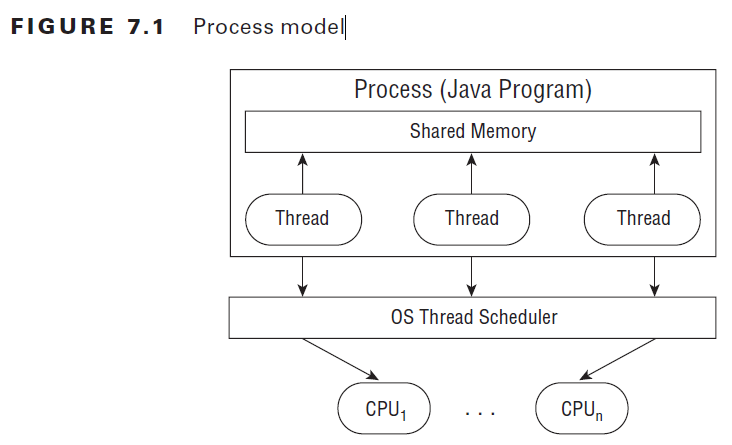
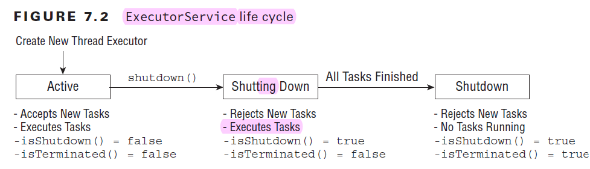
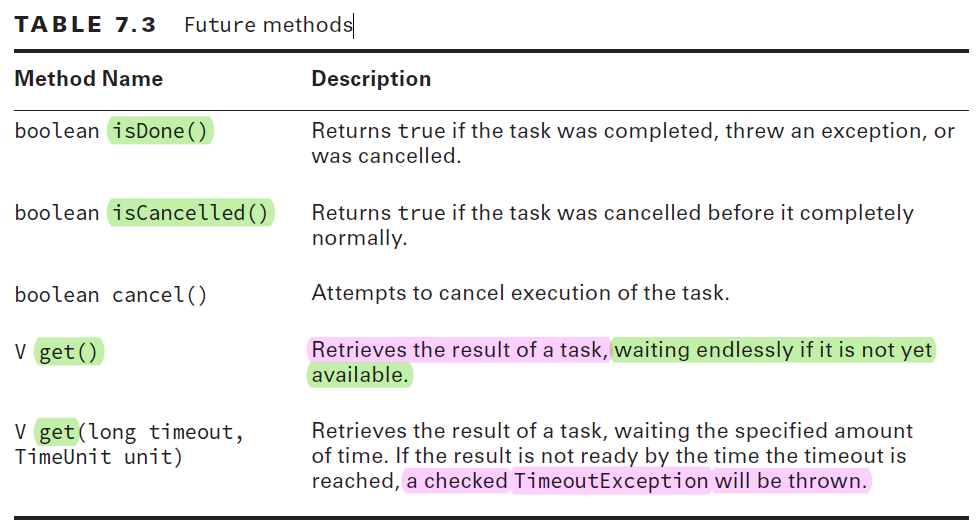

# OCP

## Chapter 1: Advanced Class Design

### Reviewing OCA Concepts

#### Access Modifiers

- private, only same class
- default, same package

  - Remember that there was a default keyword introduced in Java 8 for
    interfaces. That keyword is not an access modifier.

- protected, same package and subclasses; tricky note is subclasses is allowed through inheritance, not variable
- public, any code

#### Overloading and Overriding

- method signature is the method name and the parameter list.
- In overriding, if the return type is different, it wouldn't compile.

#### Abstract Classes

An abstract class is not required to have any methods in it, let alone any abstract
ones.

An abstract class may contain any number of methods including zero. The methods can
be abstract or concrete. Abstract methods may not appear in a class that is not abstract.
The first concrete subclass of an abstract class is required to implement all abstract
methods that were not implemented by a superclass.

#### _Static_ and _Final_

- final prevents a variable from changing or a method from being overridden.
  static makes a variable shared at the class level and uses the class name to refer to a
  method
- Using final on a class means that it cannot be subclassed
- As with methods, a class cannot be both abstract and final.
- In the Java core classes, String is final.

#### Imports

- import java.lang.\*: This package is always imported
  whether you specify it or not.
- Since sort() is a static method on Collections, you definitely
  need a static import.

### Using instanceof

In a instanceof B, the expression returns true if the reference to which a points is an
instance of class B, a subclass of B (directly or indirectly), or a class that **implements** the B
interface (directly or indirectly).

All Java classes inherit from Object, which means that x instanceof Object is usually
true, except for one case where it is false. If the literal null or a variable reference pointing
to null is used to check instanceof, the result is false. null is not an Object.

<div dir="rtl">

کامپایلر نگاه می کند که variable reference چیه. اگر امکانش باشه که در زمان اجرا به هم ربط داشته باشند، خطا نمی دهد. ولی اگر هیچ امکانی نداشته باشد که به هم ربط داشته باشند، خطای کامپایلی میدهد

</div>

The compilation check only applies when instanceof is called on a class. When checking
whether an object is an instanceof an interface, Java waits until runtime to do the
check. The reason is that a subclass could implement that interface and the compiler
wouldn’t know it.

The instanceof operator is commonly used to determine if an instance is a subclass of
a particular object before applying an explicit cast.

### Understanding Virtual Method Invocation

### Annotating Overridden Methods

An annotation is extra information about the program, and it is a type of metadata. It can be used by the compiler or even at runtime

@Override: you, the programmer, intend for this method to override one in a **superclass** or implement one from an **interface**.
**implementing an interface is actually an override.**

It so happens that the method being overridden is an **abstract** one.

@Override is helpful because the compiler now has enough information to tell you when you’ve messed up.
Or it could be that the superclass or interface changed without your knowledge.

It is a great idea to get in the habit of using @Override in order to avoid accidentally overloading a method.

@Override is allowed only when referencing a method. Just as there is no such thing as overriding a field, the annotation cannot be used on a field either.

@Override on exam:

- Implementing a method from an interface
- Overriding a superclass method of a class shown in the example
- Overriding a method declared in Object, such as hashCode, equals, or toString

### Coding equals, hashCode, and toString

all classes inherit any methods defined in Object.

Three of these methods are common for subclasses to override with a custom implementation.

#### _toString_

- Java automatically calls the toString() method if you try to print out an object
- Some classes supply a human-readable implementation of toString() and others do not. E.g. **ArrayList** does and **array** does not.
- The Easy Way to Write toString() Methods: Apache Commons Lang. It uses Reflection.

```java
public String toString() {
  return ToStringBuilder.reflectionToString(this);
}
```

#### _equals_

- Checking if two objects are equivalent uses the equals() method, or at least it does if the developer implementing the method overrides equals().
- **String** does have an equals() method. It checks that the values are the same.
- **StringBuilder** uses the implementation of equals() provided by Object, which simply checks if the two objects **being referred** to are the same.

The equals() method implements an equivalence relation on non‐null object references:

- It is **reflexive**: For any non‐null reference value x, x.equals(x) should return true.
- It is **symmetric**: For any non‐null reference values x and y, x.equals(y) should return
  true if and only if y.equals(x) returns true.
- It is **transitive**: For any non‐null reference values x, y, and z, if x.equals(y) returns
  true and y.equals(z) returns true, then x.equals(z) should return true.
- It is **consistent**: For any non‐null reference values x and y, multiple invocations of
  x.equals(y) consistently return true or consistently return false, provided no
  information used in equals comparisons on the objects is modified.
- For any non‐null reference value x, x.equals(null) should return **false** rather than throw a **NullPointerException**.

```java
public boolean equals(Lion obj) {
  if(obj == null) return false;
    return this.idNumber == obj.idNumber;
}
```

Above code does not override equals. It **overloads** it.

#### _hashCode_

The hash code is used when storing the object as a key in a map

A _hash code_ is a number that puts instances of a class into a finite number of categories.

3 contracts for hashCode():

- Within the same program, the result of hashCode() **must** not change. This means that you shouldn’t include variables that change in figuring out the hash code. In our hippo example, including the name is fine. Including the weight is not because hippos change weight regularly.
- If equals() returns true when called with two objects, calling hashCode() on each of those objects **must** return the **same result**. This means hashCode() can use a subset of the variables that equals() uses. You saw this in the card example. We used only one of the variables to determine the hash code.
- If equals() returns false when called with two objects, calling hashCode() on each of those objects does not have to return a different result. This means hashCode() results do not need to be **unique** when called on unequal objects.

- It is easier to code your own. Just pick the key fields that identify your object (and don’t change during the program) and combine them:

```java
public int hashCode() {
  return keyField + 7 * otherKeyField.hashCode();
}
```

- It is common to multiply by a **prime** number when combining multiple fields in the hash code. This makes the hash code more unique, which helps when distributing objects into buckets.

### Working with Enums

- it is common to have a **type** that can only have a finite set of values.
- An _enumeration_ is like a fixed set of constants.
- In Java, an _enum_ is a class that represents an enumeration.
- It is much better than a bunch of constants because it provides type‐safe checking.
- With numeric constants, you can pass an invalid value and not find out until **runtime**.
- With _enums_, it is impossible to create an invalid enum type without introducing a **compiler** error.
- Enumerations show up whenever you have a set of items whose types are known at compile time.
- Since an enum is like a set of constants, use the uppercase letter convention that you used for constants.
- Behind the scenes, an enum is a type of **class** that mainly contains **static members**. It also includes some helper methods like name() that you will see shortly.
- enums print the name of the enum when toString() is called.
- They are also comparable using == because they are like `static final` constants.
- An enum provides a method to get an array of all of the values. You can use this like any normal array, including in a loop: `Season.values()`
- `ordinal()` method to get the int order of enum
- You can’t compare an int and enum value directly anyway. Remember that an enum is a type and not an int. => **compile error**
- You can also create an enum from a String. This is helpful when working with older code. The String passed in must match exactly, though. Java throws up its hands in defeat and throws an **IllegalArgumentException**.
- Another thing that you can’t do is extend an enum. The values in an enum are all that are allowed. You cannot add more at runtime by extending the enum.

#### Using Enums in Switch Statements

- In fact, if you were to type case Season.WINTER in `case` statement, it would not **compile**. Keep in mind that an enum type is not an `int`.
- You can’t compare an int with an enum.

#### Adding Constructors, Fields, and Methods

### Creating Nested Classes

- A nested class is a class that is defined within another class
- A nested class that is **not static** is called an **inner class**.
- There are four of types of nested classes:
  - A **member inner class** is a class defined at the same level as instance variables. It is not static. Often, this is just referred to as an inner class without explicitly saying the type.
  - A **local inner class** is defined within a method.
  - An **anonymous inner class** is a special case of a **local inner class** that does not have a name.
  - A **static nested class** is a static class that is defined at the same level as **static variables**.
- benefits: . They can encapsulate helper classes by
  restricting them to the containing class. They can make it easy to create a class that will be used in only one place. They can make the code easier to read.

#### Member Inner Classes

A member inner class is defined at the member level of a class (the same level as the methods, instance variables, and constructors).

- Can be declared public, private, or protected or use default access
- Can extend any class and implement interfaces
- Can be **abstract** or **final**
- Cannot declare **static** fields or methods
- Can access members of the outer class including **private** members

The last property is actually pretty cool. It means that the inner class can access the outer class without doing anything special.

- Since a member inner class is not static, it has to be used with an instance of the outer class.
- .class Files for Inner Classes: Compiling the Outer.java class with which we have been working creates two class files. **Outer.class** you should be expecting. For the inner class, the compiler creates **Outer$Inner.class**.
- interesting instantiate

```java
Outer outer = new Outer();
Inner inner = outer.new Inner();
```

- Private Interfaces

```java
public class CaseOfThePrivateInterface {
  private interface Secret {
    public void shh();
  }
  class DontTell implements Secret {
    public void shh() { }
    }
  }
```

The rule that all methods in an **interface** are **public** still applies. A class that implements the interface **must** define that method as **public**.
The interface itself does not have to be **public**, though. Just like any inner class, an inner interface can be **private**. **This means that the interface can only be referred to within the current outer class.**

#### Local Inner Classes

- A local inner class is a nested class defined **within a method**.
- Like local variables, a local inner class declaration does not exist until the method is invoked, and it goes out of scope when the method returns.
- This means that you can create instances only from within the method. Those instances can still be returned from the method.
- Properties:

  - They do not have an access specifier.
  - They cannot be declared static and cannot declare static fields or methods.
  - They have access to all fields and methods of the enclosing class.
  - They do not have access to local variables of a method unless those variables are final or **effectively final**.

    - The compiler is generating a class file from your inner class. **A separate class has no way to refer to local variables.** If the local variable is final , Java can handle it by passing it to the constructor of the inner class or by storing it in the class file. If it weren’t **effectively final**, these tricks wouldn’t work because the value **could change** after the copy was made. Up until Java 7, the programmer actually had to type the **final** keyword. In Java 8, the “**effectively final**” concept was introduced. If the code could still compile with the keyword final inserted before the local variable, the variable is effectively final.
    - Objects or primitive values are **effectively final** if we do not change their values after initialization. In the case of objects, if we do not change the **reference** of an object, then it is effectively final — even if a change occurs in the **state** of the referenced object.
    - Prior to its introduction, we could not use a non-final local variable in an anonymous class. We still cannot use variables that have more than one value assigned to them inside **anonymous classes, inner classes, and lambda expressions**. The introduction of this feature allows us to not have to use the final modifier on variables that are effectively final, saving us a few keystrokes.

#### Anonymous Inner Classes

- An anonymous inner class is a local inner class that does not have a name.
- Anonymous inner classes are required to extend an existing class or implement an existing interface.
- They are useful when you have a short implementation that will not be used anywhere else.
- But what if we want to implement both an interface and extend a class? You can’t with an anonymous inner class, unless the class to extend is java.lang.Object. Object is a special class, so it doesn’t count in the rule. **Remember that an anonymous inner class is just an unnamed local inner class.** You can write a local inner class and give it a name if you have this problem. Then you can extend a class and implement as many interfaces as you like.
- There is one more thing that you can do with anonymous inner classes. You can define them right where they are needed, even if that is an argument to another method.

#### Static Nested Classes

- The final type of nested class is not an inner class. A static nested class is a static class defined at the member level.
- It can be instantiated without an object of the enclosing class, so it can’t access the instance variables without an explicit object of the enclosing class.
- For example, new OuterClass().var allows access to the instance variable var.
- it is like a regular class except for the following:

  - The nesting creates a **namespace** because the enclosing class name must be used to refer
    to it.
  - It can be made `private` or use one of the other access modifiers to encapsulate it.
  - The enclosing class can refer to the fields and methods of the `static` nested class.

- Importing a static Nested Class: Importing a static nested class is interesting. You can import it using a regular import.

```java
package bird;
public class Toucan {
  public static class Beak {}
}
package watcher;
import bird.Toucan.Beak; // regular import ok
  public class BirdWatcher {
    Beak beak;
}
```

### Summary

read in the book

## Chapter 2: Design Patterns and Principles

- teach you best practices for designing Java classes and writing applications that lead to code that is easier to understand, more maintainable, and that you and other developers can leverage in future projects.
- Adhering to the design principles and design patterns enables you to create complex class models that smoothly interact with other developers’ applications.

### Designing an Interface

- So, if a new method is to be added in an interface, then its implementation code has to be provided in the class implementing the same interface. To overcome this issue, Java 8 has introduced the concept of **default methods** which allow the interfaces to have methods with implementation without affecting the classes that implement the interface.
- The default methods were introduced to provide backward compatibility so that existing interfaces can use the lambda expressions without implementing the methods in the implementation class. Default methods are also known as defender methods or virtual extension methods. (https://www.geeksforgeeks.org/default-methods-java/#:~:text=The%20default%20methods%20were%20introduced,methods%20or%20virtual%20extension%20methods.)
- an **important** note about interfaces: . The compiler automatically adds `public` to all interface methods and `abstract` to all **non‐static and non‐default** methods, if the developer does not provide them. By contrast, the class implementing the interface **must** provide the proper modifiers.
- An interface may extend another interface, and in doing so it inherits all of the abstract methods.
- Remember that an interface cannot extend a class, nor can a class extend an interface.
- implement multiple interfaces:
- construct interfaces that have **neither methods nor class members**, traditionally referred to as **marker interfaces**. E.g. java.io.Serializable
- نکات بیشتر interface , overriding در OCA

#### Purpose of an Interface

- An interface provides a way for one individual to develop code that uses **another individual’s code**, without having access to the other individual’s **underlying implementation**.
- Interfaces can facilitate rapid application development by enabling development teams to create applications in parallel, rather than being directly dependent on each other.
  - For example, two teams can work together to develop a one‐page standard interface at the start of a project. One team then develops code that uses the interfaces while the other team develops code that implements the interface. The development teams can then combine their implementations toward the end of the project, and as long as both teams developed with the same interface, they will be compatible.
- Mock Objects: which simulates the real object that implements the interface with a simple implementation.

### Introducing Functional Programming

- Java defines a _functional interface_ as an interface that contains a **single abstract method**. Functional interfaces are used as the basis for **lambda expressions** in functional programming.
- A lambda expression is a block of code that gets passed around, like an **anonymous method**.

#### Defining a Functional Interface

- @FunctionalInterface Annotation: While it is a good practice to mark a functional interface with the @FunctionalInterface annotation for clarity, it is not required with functional programming. The Java compiler implicitly assumes that any interface that contains exactly one abstract method is a functional interface. Conversely, if a class marked with the @FunctionalInterface annotation contains more than one abstract method, or no abstract methods at all, then the compiler will detect this error and not compile.

#### Implementing Functional Interfaces with Lambdas

- Now that we have defined a functional interface, we’ll show you how to **implement** them **using lambda expressions**.
- Recall that lambda expressions rely on the notion of **deferred execution**. Deferred execution means that code is **specified now but runs later**.
- Even though the execution is deferred, the compiler will still validate that the **code syntax** is properly formed.

##### Understanding Lambda Syntax

these two are the same

```java
a -> a.canHop()
(Animal a) -> { return a.canHop(); }
```

- left side (parameter list): It can be consumed by a **functional interface** whose abstract method has the same number of parameters and compatible data types.
- right side (body): It can be consumed by a functional interface whose abstract method returns a compatible data type.
- The parentheses () can be omitted in a lambda expression if there is exactly one input parameter and **the type is not explicitly stated in the expression**. This means that expressions that have zero or more than one input parameter will still require parentheses.

##### Spotting Invalid Lambdas

- {} is needed for multiple line
- when {} is used, ; must be used
- return is required if functional interface method returns a value. Alternatively, a return statement is optional when the return type of the method is void.
- parentheses can be omitted only if there is exactly one parameter and **the data type is not specified**.
- As mentioned, the data types for the input parameters of a lambda expression are optional. When one parameter has a data type listed, though, all parameters **must** provide a data type.
- Since Java doesn’t allow us to re‐declare a local variable, the
  following is an issue:

```java
(a, b) -> { int a = 0; return 5;} // DOES NOT COMPILE
```

#### Applying the Predicate Interface

- Java has a facility for such an interface for other types called Predicate. It’s in the package java.util.function:

```java
public interface Predicate<T> {
  public boolean test(T t);
}
```

### Implementing Polymorphism

- _Polymorphism_ is the ability of a single interface to support multiple underlying forms.
- this allows multiple types of objects to be passed to a single method or class.
- a Java object may be accessed using a reference with the same type as the object, a reference that is a superclass of the object, or a reference that defines an interface that the object implements, either directly or through a superclass. Furthermore, a cast is not required if the object is being reassigned to a supertype or interface of the object.
- The ability of the Lemur object to be passed as an instance of an interface it implements, HasTail, as well as an instance of one of its superclasses, Primate, is the nature of polymorphism.
- If you use a variable to refer to an object, then only the methods or variables that are part of the variable’s reference type can be called without an explicit cast.

#### Distinguishing between an Object and a Reference

- Two rules:
  - The type of the object determines which properties exist within the object in memory.
  - The type of the reference to the object determines which method and variables are accessible to the Java program.
- It therefore follows that successfully changing a reference of an object to a new reference type may give you access to new properties of the object, but those properties existed before the reference change occurred.

#### Casting Object References

- We can **reclaim** those references by casting the object back to the specific subclass it came from.
- Here are some basic rules to keep in mind when casting variables:
  - Casting an object from a subclass to a superclass doesn’t require an **explicit cast**.
  - Casting an object from a superclass to a subclass requires an **explicit cast**. => otherwise **compiler** error
  - The compiler will not allow casts to unrelated types. => otherwise **compiler** error
  - Even when the code compiles without issue, an **exception** may be thrown at runtime if the object being cast is **not actually an instance of that class**. => otherwise **ClassCastException**
    - to avoid such a situation, use `instanceof` operator
- When faced with a question on the exam that involves casting and polymorphism, be sure to remember what the instance of the object actually is. Then focus on whether the compiler will allow the object to be referenced with or without explicit casts.

### Understanding Design Principles

- A design principle is an established idea or best practice that facilitates the software design process.

#### Encapsulating Data

- encapsulation is the idea of combining fi elds and methods in a class such that the methods operate on the data, as opposed to the users of the class accessing the fi elds directly.
- In Java, it is commonly implemented with private instance members that have public methods to retrieve or modify the data, commonly referred to as getters and setters, respectively.
- The underlying idea of encapsulation is that no actor other than the class itself should have direct access to its data.
- The class is said to encapsulate the data it contains and prevent anyone from directly accessing it.
- With encapsulation, a class is able to maintain certain invariants about its internal data.
- An **invariant** is a property or truth that is maintained even after the data is modified.
- In “Exceptions and Assertions,” we will describe how to test these class invariants using assertions.
- First we need to make instance variables `private`. This way, the class is the only one that can modify the data directly.
- Then we need to define constructors, getters, and setters that enforce these invariants.
- Anytime an instance of an Animal object is passed to a method, it can be used without requiring that its invariants be validated.
- Therefore, it is considered a good design practice always to **encapsulate all variables in a class**, even if **there are no established data rules**, as a way to protect the data when such rules may be added in the **future**.

#### Creating JavaBeans

- **Encapsulation** is so prevalent in Java that there is a standard for creating classes that store data, called **JavaBeans**.
- A JavaBean is a design principle for encapsulating data in an object in Java.
- it has some principles => go to book

#### Applying the Is‐a Relationship

use the multi‐inheritance properties of interfaces

#### Applying the Has‐a Relationship

- In object‐oriented design, we often want to test whether an object contains a particular property or value.
- The has‐a relationship is also known as the object composition test.
- If a parent has‐a object as a `protected` or `public` member, then any child of the parent must also have that object as a member. Note that this does not hold true for `private` members defined in parent classes, because **private members are not inherited in Java**.

#### Composing Objects

- In object‐oriented design, we refer to object composition as the property of constructing a class using references to other classes in order to reuse the functionality of the other classes.
- the class contains the other classes in the has‐a sense and may delegate
  methods to the other classes.
- Object composition should be thought of as an alternate to inheritance and is often used to simulate polymorphic behavior that cannot be achieved via single inheritance.
- One of the advantages of **object composition** over **inheritance** is that it tends to promote greater **code reuse**.
- By using object composition, you gain access to other classes and methods that would be difficult to obtain via Java’s single‐inheritance model.
- Object composition still requires you to explicitly expose the underlying methods and values manually, whereas inheritance includes protected and public members automatically.
- both object composition and inheritance have their proper place in developing good code, and in many cases it may be difficult to decide which path to choose.

### Working with Design Patterns

- A design pattern is an established general solution to a commonly occurring software development problem.
- creational patterns. The problem with object creation, though, lies in how you create and manage objects in more complex systems.
- One thing to keep in mind as you read this section is that under the covers, the `new` keyword is still used to create objects in memory.
- The creational patterns simply apply a level of indirection to object creation by creating the object in some other class, rather than creating the object directly in your application. Level of indirection is a general term for solving a software design problem by conceptually separating the task into multiple levels.

#### Applying the Singleton Pattern

- Problem: How do we create an object in memory only once in an application and have it shared by multiple classes?
- Motivation: By creating a singleton HayManager object, we centralize the data and remove the need to pass it around the application.
- Solution The singleton pattern is a creational pattern focused on creating only one instance of an object in memory within an application, sharable by **all classes and threads** within the application. The globally available object created by the singleton pattern is referred to as a singleton.
- By marking the constructors `private`, we have implicitly marked the class `final`. Recall that every class requires at least one constructor, with the default no‐argument constructor being added if none are provided. Furthermore, the first line of any constructor is a call to a parent constructor with the super() command. If all of the constructors are declared `private` in the singleton class, then it is impossible to create a subclass with a valid constructor; therefore, the singleton class is effectively `final`.
- Singletons are used in situations where we need access to a single set of data throughout an application. For example, application configuration data and reusable data caches are commonly implemented using singletons. Singletons may also be used to **coordinate access to shared resources, such as coordinating write access to a file**.

##### Applying Lazy Instantiation to Singletons

- سه روش ساخت داره سینگلتون
  - 1 = مستقیم شی بسازیم => در زمان لود کلاس ساخته میشه
  - 2 = با بلاک استاتیک => در زمان لود کلاس ساخته میشه
  - 3 = با استفاده از lazy instantiation => در زمان نیاز به آبجکت ساخته میشه
    - که ممکنه thread safe نباشه. یعنی چند تا همزمان بیان بسازن
    - باید synchronized اش کنی

##### Creating Unique Singletons

- because we used **lazy instantiation** in the VisitorTicketTracker class, the compiler won’t let us assign the `final` modifier to the `static` reference.
- Unfortunately, because we used lazy instantiation in the VisitorTicketTracker class, the compiler won’t let us assign the final modifier to the static reference.
- Singletons with Double‐Checked Locking: This solution has the problem that **every single call** to this method will require synchronization. In practice, this can be costly and can impact performance. Synchronization is only needed the first time that the object is created.

#### Creating Immutable Objects

- Problem: How do we create read‐only objects that can be shared and used by multiple classes?
- Solution: The immutable object pattern is a creational pattern based on the idea of creating objects whose state does not change after they are created and can be easily shared across multiple classes. Immutable objects go hand and hand with encapsulation, except that **no setter methods exist that modify the object**. Since the **state** of an immutable object never changes, they are inherently **thread‐safe**.
- example: String class is immutable

##### Applying an Immutable Strategy

5 rules:

1. Use a constructor to set all properties of the object.
2. Mark all of the instance variables `private` and `final`.
3. Don’t define any setter methods.
4. Don’t allow referenced mutable objects to be modified or **accessed** directly
   - You should never share **references** to a **mutable** object contained within an immutable object
5. Prevent methods from being **overridden**. 2 ways:
   - make class final
   - make the constructor private and apply the factory pattern

- notes: **Collections.unmodifiableList(List list)** see the example in web.
- Handling **Mutable Objects in the Constructors of Immutable Objects**: It is important when creating immutable objects that any mutable input arguments are copied to the instance instead of being used directly.

#### Using the Builder Pattern

- Problem: How do we create an object that requires numerous values to be set at the time the object is instantiated?
- Motivation: . Every time we add a parameter, the constructor grows! Users who reference our object would also be required to update their constructor calls each time that the object was modified, resulting in a class that would be difficult to use and maintain. Alternatively, we could add a new constructor each time we add a parameter, but having too many constructors can be quite difficult to manage in practice. One solution is to use setter methods instead of the constructor to configure the object, but this doesn’t work for immutable objects since they can’t be modifi ed after creation. For mutable objects, it could also lead to class invariants being temporarily broken.
  - The problem of a constructor growing too large actually has a name, referred to as the **telescoping constructor anti‐pattern**.
  - Design patterns are often written to help prevent anti‐patterns from forming
- Solution: The builder pattern is a creational pattern in which parameters are passed to a builder object, often through method chaining, and an object is generated with a final build call. It is often used with immutable objects, since immutable objects do not have setter methods and must be created with all of their parameters set, although it can be used with mutable objects as well.
- using the builder pattern is analogous to taking a **mutable** object and making it **read-only** (immutable).
- The next thing that you might notice is that all of the **setter methods** return an **instance of the builder object** `this`.
- Although we could certainly write our build() method to throw an **exception** if certain required fields are not set. Alternatively, the build() method may also **set default values** for anything the user failed to specify on the builder object.
- The **primary advantage of the builder pattern** is that, over time, this approach leads to far more **maintainable** code.
- tight coupling vs loose coupling. توضیح بیشتر توی کتاب

#### Creating Objects with the Factory Pattern

- Problem: How do we write code that creates objects in which the precise type of the object may not be known until runtime?
- Motivation: complexity of object creation, including selecting which subclass to use, as well as loosely coupling the underlying creation implementation.
- Solution: **factory method pattern**, is a creational pattern based on the idea of using a factory class to produce instances of objects based on a set of input parameters. It is similar to the builder pattern, although it is focused on supporting **class polymorphism**.
- Factory patterns are often, although not always, implemented using `static` methods that return objects and do not require a pointer to an instance of the factory class.
- to postfix the class name with the word `Factory`.
- Factory Pattern and Default Class Constructors.

## Chapter 3: Generics and Collections

This includes other lists, sets, queues, and maps.

You’ll learn how to customize searching and sorting using Comparable and Comparator.

We will end with some methods that use functional interfaces, such as forEach() and merge().

### Reviewing OCA Collections

- The _Java Collections Framework_ includes classes that implement `List`, `Map`, `Queue`, and `Set`.
- an array (like int[]) is not part of the Collections Framework.

#### Array and ArrayList

- An ArrayList is an object that contains other **objects**. An ArrayList **cannot** contain **primitives**. An array is a built-in data structure that contains **other objects or primitives**.
- Arrays.asList(array): convert array to List.
- list.toArray(): convert List to array
- Implementations of `List` are allowed to add their own behavior. The implementation used when calling asList() has the added feature of **not being resizable** but honoring all of the other methods in the interface.

#### Searching and Sorting

- Arrays.sort(array)
- Arrays.binarySearch(array, x): prints the index at which a match is found.
  - prints one less than the negated index of where the requested value would need to be inserted. (example in code)
- Collections.sort(list)
- Collections.binarySearch()
  - We call sort() and binarySearch() on Collections rather than Collection.

#### Wrapper Classes and Autoboxing

- each **primitive** has a corresponding **wrapper class**.
- _Autoboxing_ automatically converts a **primitive** to the corresponding **wrapper classes** when needed if the **generic type** is specified in the declaration.
- _Unboxing_ automatically converts a wrapper class back to a primitive.
- Refer to Table 3 .1 Wrapper classes (**Important**)
- The remove() method is **overloaded**. One signature takes an **int** as the _index_ of the element to remove. The other takes an **Object** that should be removed.

#### The Diamond Operator

- in Java 5:
  - List names = new ArrayList();
  - So we don't know which data type this list expects
- <> is called _diamond_ operator
- for readablility of code after java 8

### Working with Generics

- Why do we need **generics**? Well, remember when we said that we had to hope the caller didn’t put something in the list that we didn’t expect?
- In Java 8, this code `List names = new ArrayList();` is called non-generic list.
- a non-generic list can contain anything.
- _Generics_ can convert runtime error to compile error.

#### Generic Classes

- You can introduce generics into your own classes.
- The syntax for introducing a generic is to declare a _formal type parameter_ in angle brackets.
- here, T is a **generic type variable**

```java
public class Crate<T> {
}
```

- The generic type T is available anywhere within the Crate class. When you instantiate the class, you tell the compiler what T should be for that particular instance.
- Naming Conventions for Generics:
  - E for an element
  - K for a map key
  - V for a map value
  - N for a number
  - T for a generic data type
  - S, U, V, and so forth for multiple generic types
- **Type Erasure**:

  - Specifying a generic type allows the compiler to enforce proper use of the generic type. However, this is just for compile time. Behind the scenes, the compiler replaces all references to T in Crate with **Object**. In other words, after the code compiles, your generics are actually just **Object** types.

  ```java
  public class Crate {
    private Object contents;
    public Object emptyCrate() {
      return contents;
    }
    public void packCrate(Object contents) {
      this.contents = contents;
    }
  }
  ```

  - This means there is only **one class file**. There aren’t different copies for different parameterized types. (Some other languages work that way.)
  - This process of removing the generics syntax from your code is referred to as type erasure. Type erasure allows your code to be compatible with older versions of Java that do not contain generics.
  - The compiler adds the relevant casts for your code to work with this type of erased class.

#### Generic Interfaces

- Just like a class, an interface can declare a formal type parameter.
- 3 ways:
  - The first is to specify the generic type in the class.
  - The next way is to create a generic class.
  - The final way is to not use generics at all.

#### Generic Methods

- It is also possible to declare them on the method level.
- This is often useful for static methods since they aren’t part of an instance that can declare the type.
- However, it is also allowed on non-static methods as well.

```java
public static <T> Crate<T> ship(T t) {
  System.out.println("Preparing " + t);
  return new Crate<T>();
}
```

- Before the return type, we declare the formal type parameter of <T>.
- You can call a generic method normally, and the compiler will figure out which one you want.

#### Interacting with Legacy Code

- Legacy code is older code. It is usually code that is in a different style than you would write if you were writing the code today.
- Collections written without generics are also known as raw collections.
- Remember that using generics gives us **compile time safety**.
- At least it does when **all** of the code involved uses generics. When some code uses generics and other code does not, it is easy to get lulled into a false sense of security. lull آرامش یافتن
- Java knows that raw types are asking for trouble, and it presents a _compiler warning_ for this case.
- The **compiler warning** is Java informing you that you should take a closer look at something.
- On the exam, you have to identify when a compiler warning will occur.
- To review, the lesson is to be careful when you see code that doesn’t use generics. Pay special attention to looking for compiler warnings, ClassCastExceptions, and compiler errors.

#### Bounds

- Unbounded Wildcards
  - `List<String>` cannot be assigned to `List<Object>.`
  - List<?>
- Upper-Bounded Wildcards
  - We’ve established that a generic type can’t just use a subclass:
  - `List<? extends Number> list = new ArrayList<Integer>();`
  - The upper-bounded wildcard says that any class that extends Number or Number itself can be used as the formal parameter type.
  - type erasure makes Java think that a generic type is an `Object`.
  - Something interesting happens when we work with upper bounds or unbounded wildcards. The **list** becomes logically **immutable**. Immutable means that the object cannot be modified. (example in book)
- Lower-Bounded Wildcards

### Using Lists, Sets, Maps, and Queues

- A _collection_ is a group of objects contained in a single object.
- The _Java Collections Framework_ is a set of classes in `java.util` for storing collections.
- four main interfaces in the Java Collections Framework:

  - List: an ordered collection of elements that allows duplicate entries.
  - Set: a collection that does not allow duplicate entries.
  - Queue: a collection that orders its elements in a specific order for processing. A typical queue processes its elements in a first-in, first-out order, but other orderings are possible.
  - Map: collection that maps keys to values, with no duplicate keys allowed. The elements in a map are key/value pairs.

- Notice that `Map` doesn’t implement the Collection interface The reason why maps are treated differently is that they need different methods due to being key/value pairs.
  

#### Common Collections Methods

- add(): inserts a new element into the Collection and returns whether it was successful.
  - `boolean add(E element)`
- remove(): removes a single matching value in the Collection and returns
  whether it was successful.
  - `boolean remove(Object object)`
  - the boolean return value tells us whether a match was removed.
  - Notice that it removes only one match.
  - Since calling remove() with an int uses the index, an index that doesn’t exist will throw an exception. IndexOutOfBoundsException.
- isEmpty() and size(): look at how many elements are in the Collection.
  - `boolean isEmpty()`
  - `int size()`
- clear(): provides an easy way to discard all elements of the Collection
  - `void clear()`
- contains(): checks if a certain value is in the Collection.
  - `boolean contains(Object object)`
  - This method calls equals() on each element of the ArrayList to see if there are any matches.

#### Using the List Interface

- The main thing that all List implementations have in common is that they are ordered and allow duplicates.

##### Comparing List Implementations

- An **ArrayList** is like a resizable array. When elements are added, the ArrayList automatically grows. When you aren’t sure which collection to use, use an ArrayList.
- The main benefit of an ArrayList is that you can look up any element in constant time.
- Adding or removing an element is slower than accessing an element. This makes an ArrayList a good choice when you are reading more often than (or the same amount as) writing to the ArrayList.
- Big O notation lets you compare the order of magnitude of performance rather than the exact performance.
- A **LinkedList** is special because it implements both `List` and `Queue`.
- It also has additional methods to facilitate adding or removing from the beginning and/or end of the list.
- The main benefits of a LinkedList are that you can access, add, and remove from the beginning and end of the list in constant time.
- The tradeoff is that **dealing with an arbitrary index takes linear time**. This makes a LinkedList a good choice when you’ll be using it as **Queue**.

##### Working with List Methods

- The methods in the List interface are for working with indexes.

#### Using the Set Interface

##### Comparing Set Implementations

- A **HashSet** stores its elements in a hash table. This means that it uses the hashCode() method of the objects to retrieve them more efficiently.
- The main benefit is that adding elements and checking if an element is in the set both have constant time.
- The tradeoff is that you lose the order in which you inserted the
  elements.
- A **TreeSet** stores its elements in a sorted tree structure. The main benefit is that the set is always in sorted order. The tradeoff is that adding and checking if an element is present are both O(log n).
- **TreeSet** implements a special interface called **NavigableSet**, which lets you slice up the collection.

##### Working with Set Methods

- Remember that the equals() method is used to determine equality.
- The hashCode() method is used to know which bucket to look in so that Java doesn’t have to look through the whole set to find out if an object is there.
- The best case is that hash codes are unique, and Java has to call equal () on only **one** object. The worst case is that all implementations return the same hashCode(), and Java has to call equals() on **every** element of the set anyway.
- in TreeSet: printed out in their **natural sorted order**. یعنی مرتب می کند

##### The NavigableSet Interface

- TreeSet implements the NavigableSet interface.

#### Using the Queue Interface

- Queues are typically used for sorting elements prior to processing them.

##### Comparing Queue Implementations

- You saw **LinkedList** earlier in the List section. In addition to being a list, it is a double-ended queue. A double-ended queue is different from a regular queue in that you can insert and remove elements from both the front and back of the queue.
- The main benefit of a LinkedList is that it implements both the **List** and **Queue** interfaces. The tradeoff is that it isn’t as efficient as a “pure” queue.
- An **ArrayDeque** is a “pure” **double-ended** queue.
  - it stores its elements in a **resizable** array. The main benefit of an ArrayDeque is that it is more efficient than a LinkedList.

##### Working with Queue Methods

- ArrayeDeque methods in the book
- What if we want to insert an element at the other end, just as we could with a Stack? No problem. We just call the push() method. It works just like offer() except at the other end of the queue.
- When talking about LIFO (stack), people say push/poll/peek. When talking about FIFO (single-ended queue), people say offer/poll/peek.

#### Map

- You use a map when you want to identify values by a key.
- For example, when you use the contact list in your phone, you look up “George” rather than looking through each phone number in turn.
- You do need to know that **TreeMap** is sorted and navigable.

##### Comparing Map Implementations

- A HashMap stores the keys in a hash table. This means that it uses the hashCode() method of the keys to retrieve their values more efficiently.
- The main benefit is that adding elements and retrieving the element by key both have constant time.
- The tradeoff is that you lose the order in which you inserted the elements. Most of the time, you aren’t concerned with this in a map anyway. If you were, you could use LinkedHashMap.
- A TreeMap stores the keys in a sorted tree structure. The main benefit is that the keys are always in sorted order. The tradeoff is that adding and checking if a key is present are both O(log n).

##### Working with Map Methods

- Given that **Map doesn’t extend Collection**, there are more methods specified on the Map interface.
- Since there are both keys and values, we need generic type parameters for both. The class uses K for key and V for value.
- Refer to book to see the method lists
- Java uses the hashCode() of the **key** to determine the order. The order here happens to.
- in HashMap Java uses the hashCode() of the key to determine the order.
- The data structures that involve sorting do not allow nulls.
- which data structures allow nulls?
  - This means that **TreeSet** cannot contain null elements. It also means that **TreeMap** cannot contain null keys. Null values are OK.
  - Next comes **ArrayDeque**. You can’t put `null` in an ArrayDeque because methods like poll() use null as a special return value to indicate that the collection is empty. Since null has that meaning, Java forbids putting a null in there.
  - In handy list form, all data structures allow nulls except these:
    - TreeMap—no null keys
    - Hashtable—no null keys or values
    - TreeSet—no null elements
    - ArrayDeque—no null elements

### Comparator vs. Comparable

- We discussed “order” for the TreeSet and TreeMap classes.
- **numbers sort before letters and uppercase letters sort before lowercase letters.**
- You can also sort objects that you create. Java provides an interface called `Comparable`. If your class implements Comparable, it can be used in these data structures that require comparison.
- There is also a class called `Comparator`, which is used to specify that you want to use a different order than the object itself provides.

#### Comparable

```java
public interface Comparable<T> {
  public int compareTo(T o);
}
```

- There are three rules to know:
  - The number zero is returned when the current object is equal to the argument to compareTo().
  - A number less than zero is returned when the current object is smaller than the argument to compareTo().
  - A number greater than zero is returned when the current object is larger than the argument to compareTo().
- **compareTo() and equals() Consistency**:
  - If you write a class that implements Comparable, you introduce new business logic for determining equality. The compareTo() method returns 0 if two objects are equal, while your equals() method returns true if two objects are equal.
  - A natural ordering that uses compareTo() is said to be consistent with equals if, and only if, x equals(y) is true whenever x.compareTo(y) equals 0.
  - You are strongly encouraged to make your Comparable classes consistent with equals because not all collection classes behave predictably if the compareTo() and equals() methods are not consistent.

#### Comparator

- Sometimes you want to sort an object that did not implement Comparable, or you want to sort objects in different ways at different times.
- `Comparator` is a **functional interface** since there is only one abstract method to implement.
- Is Comparable a Functional Interface?
  - Comparable is also a functional interface since it also has a single abstract method. However, using a lambda for Comparable would be silly. The point of Comparable is to implement it inside the object being compared.
- Comparison of Comparable and Comparator table **important** refer to book
- An Easier Way of Comparing Multiple Fields
  - **Java 8** makes this much easier. With the introduction of **static and default methods** on interfaces, there are now some new helper methods on Comparator.

### Searching and Sorting

- You already know the basics of searching and sorting. You now know a little more about `Comparable` and `Comparator`.
- The sort method uses the compareTo() method to sort. It expects the objects to be sorted to be Comparable.
- `sort()` and `binarySearch()` allow you to pass in a Comparator object when you don’t want to use the natural order.

### Additions in Java 8

#### Using Method References

- _Method references_ are a way to make the code shorter by reducing some of the code that can be inferred and simply mentioning **the name of the method**.
- Like lambdas, it takes time to get used to the new syntax.
- The :: operator tells Java to pass the parameters automatically into compareByWeight.
- DuckHelper::compareByWeight returns a functional interface and not an `int`. Remember that :: is like **lambdas**, and it is typically used for **deferred execution**.
- There are four formats for method references:
  - Static methods
  - Instance methods on a particular instance
  - Instance methods on an instance to be determined at runtime
  - Constructors
- `Predicate` is a functional interface that takes a single parameter of any type and returns a boolean.
- Another functional interface is `Consumer`, which takes a single parameter of any type and has a void return type.
- Finally, `Supplier` doesn’t take any parameters and returns any type.
- A _constructor reference_ is a special type of method reference that uses `new` instead of a method, and it creates a new object.

#### Removing Conditionally

- Java 8 introduces a new method called `removeIf`.
- Before this, we had the ability to remove a specified object from a collection or a specified index from a list. Now we can specify what should be deleted using a block of code.
- `boolean removeIf(Predicate<? super E> filter)`
- It uses a Predicate, which is a lambda that takes one parameter and returns a boolean.
- Since **lambdas** use **deferred execution**, this allows specifying logic to run when that point in the code is reached.
- The most important thing to remember about `removeIf` is that it is one of two methods that are **on a collection** and it **takes a lambda parameter**.

#### Updating All Elements

- Another new method introduced on Lists is `replaceAll`. Java 8 lets you pass a lambda expression and have it applied to each element in the list.
- `void replaceAll(UnaryOperator<E> o)`
- It uses a `UnaryOperator`, which takes one parameter and returns a value of the same type.

#### Looping through a Collection

- cats.forEach(c -> System.out.println(c));
- we’ve used a Consumer, which takes a single parameter and doesn’t return anything.

#### Using New Java 8 Map APIs

- Java 8 added a number of new methods on the Map interface.
- Only merge() is listed in the OCP objectives. Two others, computeIfPresent() and computeIfAbsent(), are added in the upgrade exam objectives.
- https://www.selikoff.net/java-ocp-8-programmer-ii-study-guide/
- Sometimes you need to **update** the value for a specific key in the map.
- putIfAbsent(), that you can call if you want to set a value in the map, but this method skips it if the value is already set to a non-null value.

##### merge

- If the specified key is not already associated with a value or the value is null, it associates the key with the given value.
- Otherwise, it replaces the value with the results of the given remapping function. If the result of the remapping function is null, it removes the result.
- uses a functional interface called a BiFunction.
- The mapping function is used only when there are two actual values to decide between.
- The final thing to know about merge() is what happens when the mapping function is called and returns `null`. The key is removed from the map when this happens.

##### computeIfPresent and computeIfAbsent

- computeIfPresent() calls the BiFunction if the requested key is found.
- The function interface is a BiFunction again. However, this time the **key and value** are passed rather than two values.
- For computeIfAbsent(), the **functional interface** runs only when the key isn’t present or is `null`.
- Since there is no value already in the map, a `Function` is used instead of a BiFunction. **Only the key** is passed as input.
  - `Function<String, Integer> mapper4 = (k) -> 1;`
- If the mapping function is called and returns null, the key is removed from the map for computeIfPresent(). For computeIfAbsent(), the key is never added to the map in the first place.
- See The basics of the merge and compute methods table in the book

## Chapter 4: Functional Programming

### Using Variables in Lambdas

- the idea of “effectively final.” This meant that if you could add the `final` modifier to a local variable, it was “effectively final.”
- **Lambdas** use the same access rules as **inner classes**.
- **Lambda** expressions can _access_ **static variables**, **instance variables**, **effectively final method parameters**, and **effectively final local variables**.
- a lambda can’t access private variables in another class. Remember that lambdas can access a subset of variables that are accessible, but never more than that.

### Working with Built-In Functional Interfaces

- a functional interface has exactly **one abstract method**.
- Java 8 and are provided in the java.util.function package.
- memorize Common functional interfaces table in the book
- `Runnable` doesn’t take any parameters, return any data, or use generics.
- Let’s look at how to implement each of these interfaces:

#### Implementing Supplier

- A Supplier is used when you want to generate or supply values without taking any input.
- The Supplier interface is defined as

```java
@FunctionalInterface public class Supplier<T> {
  public T get();
}
```

- A Supplier is often used when constructing new objects.
- com.mdt.ocp.chapter4.BuiltInFunctionalInterfaces.Test$$Lambda$19/0x0000000800065c40@754ba872 => this is the address of the method reference and $$ means that the class doesn’t exist in a class file on the file system. It exists only in memory.

#### Implementing Consumer and BiConsumer

- You use a Consumer when you want to do something with a parameter but not return anything.
- BiConsumer does the same thing except that it takes two parameters.

```java
@FunctionalInterface public class Consumer<T> {
  void accept(T t);
}
@FunctionalInterface public class BiConsumer<T, U> {
  void accept(T t, U u);
}
```

#### Implementing Predicate and BiPredicate

- Predicate is often used when **filtering** or **matching**.

```java
@FunctionalInterface public class Predicate<T> {
  boolean test(T t);
}
@FunctionalInterface public class BiPredicate<T, U> {
  boolean test(T t, U u);
}
```

- you can use a Predicate to test a condition.
- **Default Methods on Functional Interfaces**
  - By definition, all functional interfaces have a single abstract method. **This doesn’t mean that they have only one method**, though. Several of the common functional interfaces provide a number of helpful _default_ methods.

#### Implementing Function and BiFunction

- A **Function** is responsible for turning one parameter into a value of a **potentially different type** and returning it.
- Omitting any default or static methods, the interfaces are defined as the following:

```java
@FunctionalInterface public class Function<T, R> {
  R apply(T t);
}
@FunctionalInterface public class BiFunction<T, U, R> {
  R apply(T t, U u);
}
```

##### Creating Your Own Functional Interfaces

- Remember that you can add any functional interfaces you’d like, and Java matches them when you use lambdas or method references.
- like:

```java
interface TriFunction<T,U,V,R> {
  R apply(T t, U u, V v);
}
```

#### Implementing UnaryOperator and BinaryOperator

- `UnaryOperator` and `BinaryOperator` are a special case of a function. They require all type parameters to be the same type.
- A `UnaryOperator` transforms its value into one of the same type. For example, incrementing by one is a unary operation. In fact, `UnaryOperator` extends `Function`.
- A `BinaryOperator` merges two values into one of the same type. Similarly, `BinaryOperator` extends `BiFunction`.

```java
@FunctionalInterface public class UnaryOperator<T> extends Function<T, T> { }
@FunctionalInterface public class BinaryOperator<T> extends BiFunction<T, T, T> { }
```

and method signatures look like this:

```java
T apply(T t);
T apply(T t1, T t2);
```

- If you look at the Javadoc, you’ll notice that these methods are actually declared on the Function/BiFunction superclass.
- We don’t need to specify the return type in the generics because UnaryOperator requires it to be the same as the parameter.

#### Checking Functional Interfaces

- It’s really important to know the number of parameters, types, return value, and method name for each of the functional interfaces.
- Note that a Predicate returns a `boolean` primitive and not a `Boolean` object.
- When you see a boolean returned, think Predicate unless the generics specify a Boolean return type.
- 3.14 is double not Long.

### Returning an Optional

- How do we express this “we don’t know” or “not applicable” answer in Java?
- with Java 8, we use the `Optional` type. An Optional is created using a factory. You can either request an empty Optional or pass a value for the Optional to wrap.
- Think of an Optional as a box that might have something in it or might instead be empty.
- Optional.empty() or Optional.of(double)
- we want to check if a value is there and/or get it out of the box.
- When creating an Optional, it is common to want to use empty when the value is null; using **tenary operator**.
- Since this is such a common pattern, Java provides a factory method to do the same thing:
- `Optional o = Optional.ofNullable(value);`
- Instead of using an if statement, which we used when checking the average earlier, we can specify a Consumer to be run when there is a value inside the Optional.
- The other methods allow you to specify what to do if a value isn’t present.
  - there are three methods, refer to **table 4.2**
- Is `Optional` the Same as `null`?
  - Before **Java 8**, programmers would return null instead of Optional.
  - There were a few shortcomings with this approach. One was that there wasn’t a clear way to express that null might be a special value. By contrast, returning an Optional is a clear statement in the API that there might not be a value in there.
  - Another advantage of Optional is that you can use a functional programming style with `ifPresent()` and the other methods rather than needing an if statement. Finally, you’ll see toward the end of the chapter that you can chain Optional calls.

### Using Streams

- A _stream_ in Java is a sequence of data.
- A _stream pipeline_ is the operations that run on a stream to produce a result.
- Finite streams have a limit. infinite streams have no limit.
- Another important feature of an assembly line is that each person touches each element to do their operation and then that piece of data is gone. It doesn’t come back. The next person deals with it **at that point**.
- This is different than the lists and queues that you saw in the last chapter. With a list, you can access **any element at any time**. With a queue, you are limited in which elements you can access, but all of the elements are there.
- With streams, the data isn’t generated up front—it is created **when needed**.
- Many things can happen in the assembly line stations along the way. In programming, these are called stream operations.
- Someone has to start and end the work, and there can be any number of stations in between.
- There are three parts to a stream pipeline:
  - _Source_: Where the stream comes from.
  - _Intermediate operations_: Transforms the stream into another one. There can be as few or as many intermediate operations as you’d like. **Since streams use lazy evaluation**, the intermediate operations **do not run until the terminal operation runs**.
  - _Terminal operation_: Actually produces a result. **Since streams can be used only once**, the stream is no longer valid after a terminal operation completes.

#### Creating Stream Sources

- In Java, the `Stream` interface is in the `java.util.stream` package.
- streams are new in Java 8.
- list.stream() and list.parallelStream()
- Using parallel streams is like setting up multiple tables of workers who are able to do the same task.
- Just keep in mind that it isn’t worth working in parallel for small streams. There is an overhead cost in coordinating the work among all of the workers operating in parallel. For small amounts of work, it is faster just to do it sequentially.
- We can’t create an infinite list, though, which makes streams more powerful.
  - `Stream.generate` and `Stream.iterate`
  - call randoms.forEach(System.out::println)

#### Using Common Terminal Operations

- You can perform a terminal operation without any intermediate operations but not the other way around.
- _Reductions_ are a special type of **terminal** operation where all of the contents of the stream are combined into a **single primitive** or `Object`. For example, you might have an int or a Collection.

##### count()

- the number of elements in a finite stream. or an infinite stream, it hangs.
- count() is a _reduction_ because it looks at each element in the stream and returns a single value.

```java
long count()
```

##### min() and max()

- allow you to pass a custom comparator and find the smallest or largest value in a finite stream according to that sort order.
- Both methods are reductions because they return a single value after looking at the entire stream.

```java
Optional<T> min(<? super T> comparator)
Optional<T> max(<? super T> comparator)
```

- Since the stream is empty, the comparator is never called and no value is present in the Optional.

##### findAny() and findFirst()

- The findAny() and findFirst() methods return an element of the stream unless the stream is empty.
- If the stream is empty, they return an empty Optional.
- This is the first method you’ve seen that works with an **infinite stream**.
- These methods are **terminal operations** but **not reductions**. The reason is that they sometimes return without processing **all of the elements**. This means that they **return a value based on the stream** but do **not reduce the entire stream into one value**.

```java
Optional<T> findAny()
Optional<T> findFirst()
```

- Finding any one match is more useful than it sounds. Sometimes we just want to **sample the results and get a representative element**, but we don’t need to waste the processing generating them all. After all, if we plan to work with only one element, why bother looking at more?

##### allMatch() , anyMatch() and noneMatch()

- search a stream and return information about how the stream **pertains** to the **predicate**. مربوط بودن، متعلق بودن
- These may or may not terminate for infi nite streams. It depends on the data. Like the fi nd methods, they are not reductions because they do not necessarily look at all of the elements.

```java
boolean anyMatch(Predicate <? super T> predicate)
boolean allMatch(Predicate <? super T> predicate)
boolean noneMatch(Predicate <? super T> predicate)
```

- On the infinite list, one match is found, so the call terminates. If we called noneMatch() or allMatch(), they would run until we killed the program.
- Remember that allMatch() , anyMatch() , and noneMatch() return a boolean. By contrast, the find methods return an `Optional` because they return an element of the stream.

##### forEach()

- A looping construct is available. As expected, calling forEach() on an infinite stream does not terminate. Since there is no return value, it is not a reduction.

```java
void forEach(Consumer<? super T> action)
```

- Notice that this is the only terminal operation with a return type of `void`.
- Remember that you can call forEach() directly on a **Collection** or on a **Stream**. Don’t get confused on the exam when you see both approaches.
- Notice that you can’t use a **traditional for loop** on a **stream**.
- While forEach() sounds like a loop, it is really a **terminal operator** for streams.
- Streams cannot use a traditional for loop to run because **they don’t implement the `Iterable` interface**.

##### reduce()

- combines a stream into a single object

```java
T reduce(T identity, BinaryOperator<T> accumulator)
Optional<T> reduce(BinaryOperator<T> accumulator)
<U> U reduce(U identity, BiFunction<U,? super T,U> accumulator, BinaryOperator<U> combiner)
```

- When you don’t specify an identity, an `Optional` is returned because there might not be any data.
- There are three choices for what is in the Optional:
  - If the stream is **empty**, an **empty Optional** is returned.
  - If the stream has **one** element, **it is returned**.
  - If the stream has **multiple** elements, the **accumulator** is **applied** to combine them.
- The third method signature is used when we are processing collections in **parallel**. It allows Java to create intermediate reductions and then **combine** them at the end.

##### collect()

- is a **special type of reduction** called a _mutable reduction_.
- It is more **efficient** than a regular reduction because we use the same mutable object while accumulating.
- Common mutable objects include `StringBuilder` and `ArrayList`.
- This is a really useful method, because it lets us get data out of streams and into another form.

```java
<R> R collect(Supplier<R> supplier, BiConsumer<R, ? super T> accumulator,
BiConsumer<R, R> combiner)
<R,A> R collect(Collector<? super T, A,R> collector)
```

- The first parameter is a Supplier that creates the object that will store the results as we collect data.
- The second parameter is a BiConsumer, which takes two parameters and doesn’t return anything. It is responsible for adding one more element to the data collection.
- The final parameter is another BiConsumer. It is responsible for taking two data collections and merging them. This is useful when we are processing in parallel. Two smaller collections are formed and then merged into one.
- The collector has three parts as before. The supplier creates an empty TreeSet. The accumulator adds a single String from the Stream to the TreeSet. The combiner adds all of the elements of one TreeSet to another in case the operations were done in parallel andneed to be merged.
- We started with the long signature because that’s how you implement your own collector. It is important to know how to do this for the exam and to understand how collectors work. In practice, there are many common collectors that come up over and over. Rather than making developers keep reimplementing the same ones, Java provides an interface with common collectors.
- go to examples in book
- The exam expects you to know about common predefined collectors in addition to being able to write your own by passing a supplier, accumulator, and combiner.
- we will show many `Collectors` that are used for grouping data.

#### Using Common Intermediate Operations

- Unlike a terminal operation, intermediate operations deal with **infinite** streams simply by returning an infinite stream.
- Since elements are produced only as needed, this works fine.
- The assembly line worker doesn’t need to worry about how many more elements are coming through and instead can focus on the current element.

##### filter()

- returns a Stream with elements that match a given expression.

```java
Stream<T> filter(Predicate<? super T> predicate)
```

- easy to remember and very powerful because we can pass any Predicate to it.

##### distinct()

- returns a stream with duplicate values removed. The duplicates do not need to be adjacent to be removed.
- Java calls equals() to determine whether the objects are the same.

```java
Stream<T> distinct()
```

##### limit() and skip()

- make a Stream **smaller**. They could make a finite stream smaller, or they could make a finite stream out of an **infinite** stream.

```java
Stream<T> limit(int maxSize)
Stream<T> skip(int n)
```

##### map()

- creates a one-to-one mapping from the elements in the stream to the elements of the next step in the stream.

```java
<R> Stream<R> map(Function<? super T, ? extends R> mapper)
```

- The map() method on streams is for transforming data. Don’t confuse it with the Map interface, which maps keys to values.

##### flatMap()

- takes each element in the stream and makes any elements it contains **top-level elements** in a single stream. This is helpful when you want to remove **empty elements** from a stream or you want to **combine a stream of lists**.

```java
<R> Stream<R> flatMap(Function<? super T, ? extends Stream<? extends R>> mapper)
```

- It returns a Stream of the type that the function contains at a lower level.
- it removed the empty list completely and changed all elements of each list to be at the top level of the stream.

##### sorted()

- returns a stream with the elements sorted.
- Just like sorting arrays, Java uses natural ordering unless we specify a comparator.

```java
Stream<T> sorted()
Stream<T> sorted(Comparator<? super T> comparator)
```

- Remember that we can pass a lambda expression as the comparator.

##### peek()

- It is useful for debugging because it allows us to perform a stream operation without actually changing the stream.

```java
Stream<T> peek(Consumer<? super T> action)
```

- The most common use for peek() is to output the contents of the stream as it goes by.
- When working with a Queue, peek() looks only at the first element. In a stream, peek() looks at each element that goes through that part of the stream pipeline. It’s like having a worker take notes on how a particular step of the process is doing.
- **Danger**: Changing State with peek(): peek() is intended to perform an operation without changing the result.
  - but we can change the stream and Java doesn’t prevent us from writing bad peek code.

#### Putting Together the Pipeline

- Streams allow you to use chaining and express what you want to accomplish rather than how to do so.

#### Printing a Stream

### Working with Primitives

- Up until now, we have been using wrapper classes when we needed primitives to go into streams. We did this with the Collections API so it would feel natural.
- With streams, there are also equivalents that work with the int, double, and long primitives.
- Let’s take a look at why this is needed.
- The primitive streams know how to perform certain common operations automatically; like sum()
- IntStream

#### Creating Primitive Streams

- three types of primitive streams:
  - IntStream: Used for the primitive types `int`, `short`, `byte`, and `char`
  - LongStream: Used for the primitive type `long`
  - DoubleStream: Used for the primitive types `double` and `float`
- Why doesn’t each primitive type have its own primitive stream? These three are the most common, so the API designers went with them.
- When you see the word stream on the exam, pay attention to the case.With a capital S or in code, Stream is the name of a class that contains an Object type. With a lowercase s , a stream is a concept that might be a Stream , DoubleStream , IntStream , or LongStream.
- Mapping methods between types of streams _table_
- Function parameters when mapping between types of streams _table_

#### Using Optional with Primitive Streams

- Difference between OptionalDouble and Optional<Double>
  - The difference is that OptionalDouble is for a primitive and Optional<Double> is for the Double wrapper class.
- DoubleSupplier instead of a Supplier
- getAsDouble instead of get
- Optional types for primitives _table_
- The `sum()` method does not return an optional. If you try to add up an empty stream, you simply get **zero**. The `avg()` method always returns an `OptionalDouble`, since an average can potentially have fractional data for any type.

#### Summarizing Statistics

- Both min() and max() are terminal operations, which means that they use up the stream when they are run. We can’t run two terminal operations against the same stream. Luckily, this  is a common problem and the primitive streams solve it for us with summary statistics.
- IntSummaryStatistics
- Here we asked Java to perform many calculations about the stream. This includes the minimum, maximum, average, size, and the number of values in the stream.

#### Learning the Functional Interfaces for Primitives


- Just as there are special streams and optional classes for primitives, there are also special functional interfaces.
- Luckily, most of them are for the double, int, and long types that you saw for streams and optionals. There is one exception, which is BooleanSupplier. We will cover that before introducing the ones for double, int, and long.

##### Functional Interfaces for boolean

- BooleanSupplier is a separate type. It has one method to implement:
  - `boolean getAsBoolean()`


<div dir="rtl"> 

----------
بسیار مهم
----------

چیزی که فهمیدم الان 
Functional Interface
یک 
interface
است که تنها یک متد abstract دارد.
حالا چه جوری پیاده سازی میشه؟
implement میشه؟
با استفاده از 
regular expression.
در واقع وقتی میگیم

```java
BooleanSupplier b1 = () -> true
```

یعنی با استفاده از رگیولار اکسپرشن سمت راست تساوی، این اینترفیس را پیاده سازی کردیم و 
b1 
در واقع پیاده سازی این اینترفیس است با بدنه ی تابع سمت راست که چون 1 تابع
abstract 
بیشتر ندارد، پیاده سازی را به صورت اتوماتیک برای آن تابع لحاظ می کند.

</div>

----------

##### Functional Interfaces for double, int, and long

- Most of the functional interfaces are for double, int, and long to match the streams and optionals that we’ve been using for primitives.

### Working with Advanced Stream Pipeline Concepts

- You’ll see the relationship between streams and the underlying data, chaining Optional and grouping collectors.

#### Linking Streams to the Underlying Data

- Remember that **streams** are **lazily evaluated**. This means that the stream isn’t actually created on line 28.
- The stream pipeline runs first, looking at the source and seeing three elements.

#### Chaining Optionals

- By now, you are familiar with the benefits of chaining operations in a stream pipeline. **A few of the intermediate operations for streams are available for Optional**.
- for examplle: optional.map(String::length) or filter
- map() returns Optional
- using flatMap() to overcome map()

#### Checked Exceptions and Functional Interface

- the functional interfaces do not declare **checked exceptions**. This is normally OK. However, it is a problem when working with methods that declare checked exceptions.
- What are **checked exceptions**?
  - Checked exceptions are checked at compile-time. It means if a method is throwing a checked exception then it should handle the exception using try-catch block or it should declare the exception using throws keyword, otherwise the program will give a compilation error.
- two solutions:
  - One is to catch the exception and turn it into an **unchecked exception**:
  - Another alternative is to create a wrapper method with the try/catch.

#### Collecting Results

- group the results
- you saw the collect() terminal operation.
- There are many predefined collectors, including those shown in Table 4.11
- Examples of grouping/partitioning collectors table

##### Collecting Using Basic Collectors

- Notice how the predefined collectors are in the Collectors class rather than the Collector class. This is a common theme, which you saw with Collection vs. Collections.
- With primitive streams, the result of an average was always a double, regardless of what type is being averaged.

##### Collecting into Maps

- Collector code involving maps can get long. We will build it up slowly. Make sure that you understand each example before going on to the next one.
- When creating a map, you need to specify two functions. The first function tells the collector how to create the key.
- You can rewrite s -> s as Function.identity(). both are equal

##### Collecting Using Grouping, Partitioning, and Mapping

- we want to get groups of names by their length
- The groupingBy() collector tells collect() that it should group all of the elements of the stream into lists, organizing them by the function provided. This makes the keys in the map the function value and the values the function results.
- There’s another method signature that lets us pass a downstream collector.
- _Partitioning_ is a special case of grouping.
- With partitioning, there are only two possible groups—true and false.
- Partitioning is like splitting a list into two parts.
- Notice that there are still two keys in the map—one for each boolean value. It so happens that one of the values is an empty list, but it is still there.

### Summary

- very important go to book

## Chapter 1: Dates, Strings, and Localization

### Working with Dates and Times

- You need an import to work with the date and time classes. java.time package
- In the following sections, we’ll look at creating, manipulating, and formatting dates and times.

#### Creating Dates and Times

- When working with dates and times, the first thing to do is to decide how much information you need. The exam gives you four choices:
  - LocalDate: Contains just a date—no time and no time zone.
  - LocalTime: Contains just a time—no date and no time zone.
  - LocalDateTime: Contains both a date and time but no time zone.
  - ZonedDateTime: Contains a date, time, and time zone

- Oracle recommends avoiding time zones unless you really need them.
- you obtain date and time instances using a `static` method.
- Each of the four classes has a static method called now(), which gives the current date and time.
- Java uses T to separate the date and time when converting LocalDateTime to a String.
- Greenwich Mean Time is a time zone in Europe that is used as time zone zero when discussing offsets.
- You might have also heard of Coordinated Universal Time , which is a time zone standard. It is abbreviated as a UTC, as a compromise between the English and French names.
- UTC uses the same time zone zero as GMT.
- The time zone offset can be listed in different ways: +02:00, GMT+2, and UTC+2 all mean the same thing.
- Just remember that the **month comes before the date.**
- let’s look at other specific dates and times.

```java
public static LocalDate of(int year, int month, int dayOfMonth)
public static LocalDate of(int year, Month month, int dayOfMonth)
```

- Month is an enum. Remember that an **enum is not an int** and cannot be compared to one.
- Up to now, we’ve been continually telling you that Java counts starting with 0. Well, months are an exception.
- For months in the new date and time methods, Java counts starting from 1, just as we humans do.
- When creating a time, you can choose how detailed you want to be. You can specify just the hour and minute, or you can include the number of seconds. You can even include nanoseconds if you want to be very precise.

```java
public static LocalTime of(int hour, int minute)
public static LocalTime of(int hour, int minute, int second)
public static LocalTime of(int hour, int minute, int second, int nanos)
```

- In order to create a ZonedDateTime, we first need to get the desired time zone.

```java
public static ZonedDateTime of(int year, int month,
int dayOfMonth, int hour, int minute, int second, int nanos, ZoneId zone)
public static ZonedDateTime of(LocalDate date, LocalTime time, ZoneId zone)
public static ZonedDateTime of(LocalDateTime dateTime, ZoneId zone)
```

- Finding a Time Zone
  - using functional programming

  ```java
  ZoneId.getAvailableZoneIds().stream()
  .filter(z -> z.contains("US") || z.contains("America"))
  .sorted().forEach(System.out::println);
  ```

- Did you notice that we did not use a constructor in any of the examples? The date and time classes have `private` constructors to **force** you to use the factory’s `static` methods.
- Another trick is what happens when you pass invalid numbers to of() => DateTimeException

#### Manipulating Dates and Times

- Adding to a date is easy. The **date and time** classes are **immutable**.
- this means that we need to remember to assign the results of these methods to a **reference variable** so that they are not lost.
- There are also nice, easy methods to go backward in time.
- Whenever you see **immutable types**, pay attention to make sure that the return value of a method call isn’t ignored.

#### Working with Periods

- Converting to a long:
  - LocalDate and LocalDateTime have a method to convert themselves into long equivalents in relation to January 1, 1970.
  - This special date is called the **epoch**.
  - **LocalDate** has toEpochDay(), which is the number of days since January 1, 1970.
  - **LocalDateTime** and **ZonedDateTime** have toEpochSecond(), which is the  number of seconds since January 1, 1970.
  - **LocalTime** does not have an epoch method. Since it represents a time that can occur on any date, it doesn’t make sense to compare it to 1970.
  - you may be wondering if this special January 1, 1970, is in a specific time zone. The answer is yes. This special time refers to when it was January 1, 1970, in GMT (Greenwich mean time). Greenwich is in England, and GMT does not participate in daylight savings time.

- Java has a `Period` class that we can pass in.
- There are five ways to create a Period class:
  - Period annually = Period.ofYears(1); // every 1 year
  - Period quarterly = Period.ofMonths(3); // every 3 months
  - Period everyThreeWeeks = Period.ofWeeks(3); // every 3 weeks
  - Period everyOtherDay = Period.ofDays(2); // every 2 days
  - Period everyYearAndAWeek = Period.of(1, 0, 7); // every year and 7 days
- You cannot **chain** methods when creating a Period. Only the last method is used because the Period of___ methods are `static` methods.
- The of() method takes only years, months, and days. The ability to use another factory method to pass weeks is merely a convenience.
- Period format:
  - P1Y2M3D
- If any of these are zero, they are omitted.
- Remember that week is not one of the units a Period stores. Therefore, a week is converted to 7 days.
- The last thing to know about Period is what objects it can be used with.

#### Working with Durations

- You’ve probably noticed by now that a Period is a **day** or more of **time**.
- There is also Duration, which is intended for smaller units of time.
- For Duration, you can specify the number of days, hours, minutes, seconds, or nanoseconds.
- Duration roughly works the same way as Period, except it is used with objects that have time.
- Remember that a Period is output beginning with a P. Duration is output beginning with PT, which you can think of as a period of time.
- A Duration is stored in hours, minutes, and seconds. The number of seconds includes fractional seconds.
- Duration doesn’t have a constructor that takes multiple units like Period does. If you want something to happen every hour and a half, you would specify 90 minutes.
- Duration includes another more generic factory method. It takes a number and a TemporalUnit. The idea is, say, something like “5 seconds.” However, TemporalUnit is an interface. At the moment, there is only one implementation named ChronoUnit.
  - ChronoUnit.HALF_DAYS represent 12 hours.
- ChronoUnit for Differences:
  - ChronoUnit is a great way to determine how far apart two Temporal values are. Temporal includes LocalDate, LocalTime, and so on.
- Using a Duration works the same way as using a Period.
- Remember that `Period` and `Duration` are **not equivalent**. This example shows a Period and Duration of the same length:
- Since we are working with a `LocalDate`, we are required to use `Period`. `Duration` has **time units in it**, even if we don’t see them and they are meant **only** for objects with **time**.

#### Working with Instants

- The `Instant` class represents a specific moment in time in the **GMT time zone**.
- If you have a `ZonedDateTime`, you can turn it into an `Instant`.
- The ZonedDateTime includes a time zone. The Instant gets rid of the time zone and turns it into an Instant of time in GMT.
- You cannot convert a `LocalDateTime` to an `Instant`. **Remember that an Instant is a point in time**. A `LocalDateTime` does not contain a time zone, and it is therefore not universally recognized around the world as the same moment in time.
- If you have the number of seconds since 1970, you can also create an Instant that way.

#### Accounting for Daylight Savings Time

- Some countries observe daylight savings time.
- his is where the clocks are adjusted by an hour twice a year to make better use of the sunlight.
- Not all countries participate, and those that do use different weekends for the change.

**Chapter 5 not completed** 990912 I am not in the mood to complete this chapter, maybe another day

## Chapter 6: Exceptions and Assertions

### Reviewing Exceptions

- Reason of program failure
  - Your program tries to read a file that doesn’t exist.
  - Your program tries to access a database, but the network connection to the database is
unavailable.
  - You made a coding mistake and wrote an invalid SQL statement in your JDBC code.
  - You made a coding mistake and used the wrong format specifiers when using DateTimeFormatter.
- As you can see, some of these are coding mistakes. Others are completely beyond your control. Your program can’t help it if the network connection goes down. What it can do is deal with the situation.

#### Exceptions Terminology

- An exception is Java’s way of saying, “I give up. I don’t know what to do right now. You deal with it.”

#### Categories of Exceptions

- Remember that a _runtime exception_, or **unchecked** exception, may be caught, but it is **not required** that it be caught.
- After all, if you had to check for NullPointerException, every piece of code that you wrote would need to deal with it.
- A _checked exception_ is any class that extends `Exception` but is not a runtime exception.
- Checked exceptions must follow the _handle_ or _declare_ rule where they are either caught or thrown to the caller.
- An error is fatal and should not be caught by the program. While it is legal to catch an error, it is not a good practice


#### Exceptions on the OCP

- java.io.IOException is an example of a **checked exception**.
- On the OCP, you need to know more exceptions. The objectives cover a number of APIs that throw a mix of checked and unchecked exceptions.
- Just remember that **IO**, **parsing**, and **SQL** exceptions are _checked_.
- Anything else is a runtime exception unless the exam states otherwise.

#### Try Statement

- The try statement consists of a **mandatory** try clause.
- It can include one or more catch clauses to handle the exceptions that are thrown.
- It can also include a finally clause, which runs regardless of whether an exception is thrown.

- Two rules:
  - Java checks the catch blocks in the order in which they appear. It is illegal to declare a subclass exception in a catch block that is lower down in the list than a superclass exception because it will be unreachable code.
  - Java will not allow you to declare a catch block for a checked exception type that cannot potentially be thrown by the try clause body. This is again to avoid unreachable code.

#### Throw vs. Throws

- Remember that throw means an exception is actually being thrown and throws indicate that the method merely has the potential to throw that exception.

```java
10: public String getDataFromDatabase() throws SQLException {
11:  throw new UnsupportedOperationException();
}
```

- Line 10 declares that the method might or might not throw a SQLException . Since this is a checked exception, the caller needs to handle or declare it. Line 11 actually does throw an UnsupportedOperationException . Since this is a runtime exception, it does not need to be declared on line 10.

### Creating Custom Exceptions

- When creating your own exception, you need to decide whether it should be a checked or unchecked exception.
- While you can extend any exception class, it is most common to extend Exception (for checked) or RuntimeException (for unchecked).
- the three most common constructors defined by the Exception class:

```java
public class CannotSwimException extends Exception {
  public CannotSwimException() {
    super();
  }
  public CannotSwimException(Exception e) {
    super(e);
  }
  public CannotSwimException(String message) {
    super(message);
  }
}
```

- The first constructor is the default constructor with no parameters. The second constructor shows how to wrap another exception inside yours. The third constructor shows how to pass a custom error message.
- Using a different constructor allows you to provide more information about what went wrong. We would get output like this if we wrote a main method with the line throw new CannotSwimException(); : 
  - Exception in thread "main" CannotSwimException at CannotSwimException.main(CannotSwimException.java:18)
- throw new CannotSwimException(new RuntimeException());
- throw new CannotSwimException("broken fin");
- You can also print the stack trace on your own:

```java
try {
  throw new CannotSwimException();
} catch (CannotSwimException e) {
  e.printStackTrace();
}
```

### Using Multi-catch

- When something goes wrong in a program, it is common to log the error and convert it to a different exception type.
- In Java 7, they introduced the ability to catch multiple exceptions in the same catch block, also known as multi-catch.

```java
try {
//protected code
} catch(Exception1 | Exception2 e) {
//exception handler
}
```

- Remember that the exceptions can be listed in any order within the catch clause. However, the variable name must appear only once and at the end.

```java
catch(Exception1 e | Exception2 e | Exception3 e) // DOES NOT COMPILE
catch(Exception1 e1 | Exception2 e2 | Exception3 e3) // DOES NOT COMPILE
```

- Java intends multi-catch to be used for exceptions that aren’t related and it prevents you from specifying redundant types in a multi-catch.
- FileNotFoundException is a subclass of IOException. Specifying it in the multi-catch is redundant.
- **Multi-catch** Is **Effectively Final**:

```java
try {
  // do some work
} catch(RuntimeException e) {
  e = new RuntimeException();
}
```

- but, the following code does not compile. Java forbids reassigning the exception variable in a multi-catch situation.

```java
try {
  throw new IOException();
} catch(IOException | RuntimeException e) {
  e = new RuntimeException(); // DOES NOT COMPILE
}
```

- only **checked exceptions** that have the **potential** to be thrown are **allowed** to **be caught**.

### Using Try-With-Resources

- Multi-catch allows you to write code without duplication.
- nother problem arises with duplication in `finally` blocks.
- it is important to close resources when you are finished with them.
- Using try-with-resources There is no longer code just to close resources. The new _try-with-resources_ statement automatically closes all resources opened in the try clause. This feature is also known as _automatic resource management_, because Java automatically takes care of the closing.
- Ensuring Resources Are Closed: we sometimes come across code that appears to guarantee resource closure, but in fact it does not. 

  ```java
  } finally {
    if (in != null) in.close();
    if (out != null) out.close();
  }
  ```

  - above code leads to a **resource leak**. If in.close() throws an exception, then out.close() will never be executed, leaving us with an unclosed resource!

  ```java
  } finally {
    try {
      in.close();
    } catch (IOException e) {}
    try {
      out.close();
    } catch (IOException e) {}
  }
  ```

  - Luckily, try-with-resources avoids the need to keep writing code like this by hand!

#### Try-With-Resources Basics

- You might have noticed that there is no finally block in the try-with-resources code.
- <span style="color:green">you learned that a **try** statement **must** have **one or more catch** blocks _or_ **a finally block**.</span>.
- This is still true. The finally clause exists **implicitly**. You just don’t have to type it.
- Remember that only a try-with-resources statement is permitted to omit both the catch and finally blocks. A traditional try statement **must** have **either or both**.
- a try-with-resources statement is still allowed to have catch and/ or finally blocks. They are run in addition to the implicit one. The implicit finally block runs before any programmer-coded ones.
- The resources created in the try clause are only in scope within the try block. This is another way to remember that the implicit finally runs before any catch finally blocks that you code yourself. The implicit close has run already, and the resource is no longer available.
- In a traditional try statement, the variable has to be declared before the try statement so that both the try and finally blocks can access it, which has the unpleasant side effect of making the variable in scope for the rest of the method, just inviting you to call it by accident.

#### AutoCloseable

- You can’t just put any random class in a try-with-resources statement. Java commits to closing automatically any resources opened in the try clause.
- Java doesn’t allow this. It has no idea how to close a Turkey. Java informs us of this fact with a compiler error.
- In order for a class to be created in the try clause, Java requires it to implement an interface called `AutoCloseable`.
  - void close() throws Exception
- an overriding method is allowed to declare **more specific** exceptions than the parent or **even none at all**. By declaring Exception, the AutoCloseable interface is saying that implementers may throw **any exceptions they choose**.
- Java strongly recommends that close() not actually throw Exception. It is better to throw a more specific exception. Java also recommends to make the close() method _idempotent_. Idempotent means that the method can called be multiple times without any side effects or undesirable behavior on subsequent runs.
  - **specific** and **idempotent**
- AutoCloseable vs. Closeable: **Closeable** is before java 7
  - Closeable restricts the type of exception thrown to `IOException`.
  - Closeable requires implementations to be *idempotent*.

#### Suppressed Exceptions

- What happens if the close() method throws an exception?
- We already know that the resources are closed before any programmer-coded catch blocks are run.
- This means that we can catch the exception thrown by close() if we wish. Alternatively, we can allow the caller to deal with it. Just like a regular exception, **checked** exceptions must be **handled** or **declared**. **Runtime** exceptions **do not need to be acknowledged**.
- What happens if the try block also throws an exception? Java 7 added a way to accumulate exceptions. When multiple exceptions are thrown, all but the first are called suppressed exceptions. The idea is that Java treats the first exception as the primary one and tacks on any that come up while automatically closing.
- Keep in mind that the `catch` block looks for matches on the **primary**  exception.
- Java remembers the **suppressed exceptions** that go with a **primary** exception even if we don’t handle them in the code.
- <span style="color:green">Java closes resources in the **reverse** order from which it created them.</span>
- Since it is the first exception to occur, it becomes the primary exception. Then t1 is closed. Since an exception has already been thrown, this one becomes a suppressed exception.
- Remember that Java needs to be backward compatible. try and finally were both allowed to throw an exception long before Java 7. When this happened, the **finally block took precedence**, and the previous exception is **lost**.

#### Putting It Together

- You’ve learned two new rules for the order in which code runs in a try-with-resources statement:
  - Resources are closed after the try clause ends and before any catch/finally clauses.
  - Resources are closed in the reverse order from which they were created.

### Rethrowing Exceptions

- It is a common pattern to **log** and then **throw** **the same exception.

```java
public void parseData() throws SQLException, DateTimeParseException {}
```

- When calling this method, we need to **handle** or **declare** those two exception types.

```java
public void multiCatch() throws SQLException, DateTimeParseException {
  try {
    parseData();
  } catch (SQLException | DateTimeParseException e) {
    System.err.println(e);
    throw e;
  } 
}
```

- The list of exceptions in the catch block and the list of exceptions in the method signature of multiCatch() are the same. This is duplication.
- Since there were a number of changes in Java 7, the language designers decided to solve this problem at the same time. They made it legal to write Exception in the catch block but really only a limited set of exceptions.

```java
public void rethrowing() throws SQLException, DateTimeParseException {
  try {
    parseData();
  } catch (Exception e) {
    System.err.println(e);
    throw e;
  } }
```

- This time, Java interprets Exception as the possible exceptions that can be thrown in the method. As long as all of these checked exceptions are handled or declared, Java is happy.
- Notice how we said that the two examples are similar; that is, they are not the same. What happens if parseData() throws a NullPointerException? In the multi-catch version, the exception will not be caught in the catch block and will not be logged to System.err. In the rethrowing example, it will be caught, logged, and rethrown.

### Working with Assertions

- An assertion is a Boolean expression that you place at a point in your code where you expect something to be true.
- The English defi nition of the word assert is to state that something is true, which means that you assert that something is true.
- An assert statement contains this statement along with an optional String message.

#### The assert Statement

```java
assert boolean_expression;
assert boolean_expression: error_message;
```

- The boolean expression must evaluate to true or false.
- The optional error message is a String used as the message for the AssertionError that is thrown.
- An assertion throws an `AssertionError` if it is `false`.
- Since programs aren’t supposed to catch an `Error`, this means that **assertion failures** are **fatal** and **end the program**.
- The three possible outcomes of an assert statement are as follows:
  - If assertions are disabled, Java skips the assertion and goes on in the code.
  - If assertions are enabled and the boolean expression is true , then our assertion has been validated and nothing happens. The program continues to execute in its normal manner.
  - If assertions are enabled and the boolean expression is false , then our assertion is invalid and a java.lang.AssertionError is thrown.
- Presuming assertions are enabled, an assertion is a shorter/better way of writing the following:
  - if (!boolean_expression) throw new AssertionError();
- Remember when we said a developer shouldn’t be throwing an `Error`? With the assert syntax, you aren’t. **Java** is throwing the Error.
- `java –ea Assertions` command is for enabling assertion.

#### Enabling Assertions

- By default, assert statements are ignored by the JVM at runtime.
- To enable assertions, use the -enableassertions flag on the command line:

```java
java -enableassertions Rectangle
```

- You can also use the shortcut -ea flag:

```java
java -ea Rectangle
```

- Using the -enableassertions or -ea flag without any arguments enables assertions in all classes except system classes.
- System classes are classes that are part of the Java runtime.
- You can also enable assertions for a specific class or package:

```java
java -ea:com.wiley.demos... my.programs.Main
```

- The three dots means any class in the specifi ed package or subpackages.
- You can disable assertions using the -disableassertions (or -da ) fl ag for a specific class or package that was previously enabled.
- Enabling assertions is an important aspect of using them, because if assertions are not enabled, assert statements are ignored at runtime.

#### Using Assertions

- use assertions for these reasons:
  - Internal Invariants
  - Class Invariants
  - Control Flow Invariants
  - Preconditions
  - Post Conditions
- Assertions Should Not Alter Outcomes:
  - Because assertions can, should, and probably will be turned off in a production environment, your assertions should not contain any business logic that affects the outcome of your code.
- Validating Method Parameters:
  - Do not use assertions to check for valid arguments passed in to a method. Use an IllegalArgumentException instead.
  - Remember, assertions are for situations where you are certain of something and you just want to verify it.

### Summary

- Subclasses of java.lang.Error are exceptions that a program should not attempt to handle.
- Subclasses of java.lang.RuntimeException are runtime (unchecked) exceptions.
- Subclasses of java.lang.Exception that do not subclass java.lang.RuntimeException are checked exceptions.
- Java requires checked exceptions to be handled or declared.
- If a try statement has multiple catch blocks, at most one catch block can run. Java looks for an exception that can be caught by each catch block in the order in which they appear, and the first match is run. Then execution continues after the try statement to the finally block if present. If both `catch` and `finally` throw an exception, the one from `finally` gets thrown.

## Concurrency

- In 2004, Java 5 was released and the Concurrency API was introduced in the java.util.concurrent package.
- It included numerous classes for performing complex thread-based tasks. The idea was simple: managing complex thread interactions is quite difficult for even the most skilled developers; therefore a set of reusable features was created.
- The Concurrency API has grown over the years to include numerous classes and frameworks to assist you in developing complex, multi-threaded applications.
- In this chapter, we will introduce you to the concept of threads and provide numerous ways to manage threads using the Concurrency API.

### Introducing Threads

- A _thread_ is the smallest unit of execution that can be scheduled by the operating system.
- A _process_ is a group of **associated threads** that execute in the **same, shared** environment.
- a _single-threaded process_ is one that contains exactly one thread, whereas a _multi-threaded process_ is one that contains one or more threads.
- By *shared environment*, we mean that the threads in the **same process** share the **same memory space** and can communicate **directly** with one another.
- Yes, you will finally see how `static` variables can be useful for performing complex, multi-threaded tasks!
- `static` methods and variables are defined on a single class object that all instances share. if one thread updates the value of a static object, then this information is immediately available for other threads within the process to read.
- A `task` is a single unit of work performed by a thread.
- Throughout this chapter, a task will commonly be implemented as a _lambda expression_.
- A thread can complete multiple independent tasks but only one task at a time.



#### Distinguishing Thread Types

- It might surprise you that all Java applications, including all of the ones that we have presented in this book, are all multi-threaded.
- To help you understand this, we introduce the concepts of **system threads** and **user-defined threads**.
- A _system thread_ is created by the JVM and runs in the background of the application.
  - the garbage-collection thread is a system thread that is created by the JVM and runs in the background, helping to free memory that is no longer in use.
  - When a system-defi ned thread encounters a problem and cannot recover, such as running out of memory, it generates a Java Error , as opposed to an Exception.
- a _user-defined thread_ is one created by the application developer to accomplish a specific task.
- All of the applications that we have created up to this point have been multi-threaded, but they contained only one user-defined thread, which calls the main() method.
- we commonly refer to threads that contain only a single user-defined thread as a **single-threaded application**, since we are often uninterested in the system threads.
- a _daemon thread_ is one that will not prevent the JVM from exiting when the program finishes. A Java application terminates when the only threads that are running are daemon threads. if the garbage-collection thread is the only thread left running, the JVM will automatically shut down. Both system and user-defined threads can be marked as daemon threads.

#### Understanding Thread Concurrency

- The property of executing **multiple threads and processes** at the same time is referred to as **concurrency**.
- Operating systems use a **thread scheduler** to determine which threads should be currently executing.
- a thread scheduler may employ a round-robin schedule in which each available thread receives an equal number of CPU cycles with which to execute, with threads visited in a circular order.
- When a thread’s allotted time is complete but the thread has not finished processing, a context switch occurs. A context switch is the process of storing a thread’s current state and later restoring the state of the thread to continue execution.
- Be aware that there is often a cost associated with a context switch by way of lost time saving and reloading a thread’s state.
- a thread can interrupt or supersede another thread if it has a higher thread priority than the other thread. A thread priority is a numeric value associated with a thread that is taken into consideration by the thread scheduler when determining which threads should currently be executing.
- By default, user-defined threads receive a thread priority value of Thread NORM_PRIORITY. If you have a thread that must be executed right away, you can increase this value to 6 or higher or use the Thread.MAX_PRIORITY value. If two threads have the same priority, the thread scheduler will arbitrarily choose the one to process first in most situations.
  - Thread.MIN_PRIORITY 1
  - Thread.NORM_PRIORITY 5
  - Thread.MAX_PRIORITY 10

#### Introducing Runnable

- java.lang.Runnable, or Runnable for short, is a functional interface that takes no arguments and returns no data.

```java
@FunctionalInterface public interface Runnable {
  void run();
}
```

- The `Runnable` interface is commonly used to **define the work a thread will execute**, separate from the main application thread.
- We will be relying on the `Runnable` interface throughout this chapter, especially when we discuss applying parallel operations to streams.
- The following lambda expressions each rely on the Runnable interface:

```java
() -> System.out.println("Hello World")
() -> {int i=10; i++;}
() -> {return;}
() -> {}
```

- These examples are invalid Runnable expressions because they each return a value.

```java
() -> ""
() -> 5
() -> {return new Object();}
```

- Creating Runnable Classes: It was, and still is, commonly used to define a thread task by creating a class that implements the Runnable interface.
- In this chapter, we focus on creating **lambda expressions** that implicitly **implement** the **Runnable interface**.

#### Creating a Thread

- The simplest way to **execute a thread** is by using the java.lang.Thread class, or Thread for short.
- Executing a task with Thread is a two-step process. First you define the Thread with the corresponding task to be done. Then you start the task by using the Thread.start() method.
- Java does not provide any guarantees about the order in which a thread will be processed once it is started. It may be executed immediately or delayed for a signifi cant amount of time.
- Defining the **task, or work**, that a Thread instance will execute can be done two ways in Java:
  - Provide a `Runnable` object or **lambda expression** to the Thread **constructor**.
  - Create a class that **extends** Thread and overrides the run() method.
- Anytime you create a Thread instance, make sure that you remember to start the task with the Thread.start() method. This starts the task in a separate operating system thread.
- In general, you should extend the Thread class only under very specific circumstances, such as when you are creating your **own priority-based thread**. **In most situations, you should implement the `Runnable` interface rather than extend the `Thread` class.**
- For Interviews, Be Familiar with Thread-Creation Options:
  - If you need to define your own Thread rules upon which multiple tasks will rely, such as a priority Thread, extending Thread may be preferable.
  - Since Java doesn't support multiple inheritance, extending Thread does not allow you to extend any other class, whereas implementing Runnable lets you extend another class.
  - Implementing Runnable is often a better object-oriented design practice since it separates the task being performed from the Thread object performing it.
  - Implementing Runnable allows the class to be used by numerous Concurrency API classes.

#### Polling with Sleep

- Oftentimes, you need a thread to poll for a result to finish.
- Polling is the process of intermittently checking data at some fixed interval.

### Creating Threads with the ExecutorService

- With the announcement of the `Concurrency` API, Java introduced the `ExecutorService`, which **creates and manages threads for you**.
- You first obtain an instance of an `ExecutorService` interface, and then you send the service tasks to be processed.
- The framework includes numerous useful features, such as **thread pooling and scheduling**, which would be cumbersome for you to implement in every project.
- Therefore, it is recommended that you use this **framework** anytime you need to create and execute a separate task, even if you need only a single thread.

#### Introducing the Single-Thread Executor

- Since ExecutorService is an interface, how do you obtain an instance of it?
- The Concurrency API includes the `Executors` factory class that can be used to create instances of the `ExecutorService` object.
- newSingleThreadExecutor() method to obtain an ExecutorService instance and the execute() method to perform asynchronous tasks:
- `ExecutorService` extends `Executors`
- we used the `newSingleThreadExecutor()` method, which is the simplest `ExecutorService` that we could create.
- With a **single-thread executor**, results are guaranteed to be executed in the order in which they are added to the executor service.
- Executing Multiple Tasks: refer to book

#### Shutting Down a Thread Executor

- Once you have finished using a thread executor, it is important that you call the `shutdown()` method.
- A thread executor creates a non-daemon thread on the **first** task that is executed, so **failing** to call shutdown() will result in your application never terminating.



- For the exam, you should be aware that shutdown() does not actually stop any tasks that have already been submitted to the thread executor.
- What if you want to cancel all running and upcoming tasks? The ExecutorService provides a method called shutdownNow(), which attempts to stop all running tasks and discards any that have not been started yet.
- Note that shutdownNow() _attempts_ to stop all running tasks. It is possible to create a thread that will never terminate, so any attempt to interrupt it may be ignored.
- Lastly, shutdownNow() returns a List<Runnable> of tasks that were submitted to the thread executor but that were never started.
- Finally Shutting Down a Thread Executor: Resources such as thread executors should be properly closed to prevent memory leaks. Unfortunately, the `ExecutorService` interface does not implement `AutoCloseable`, so you cannot use a `try-with-resources` statement.

#### Submitting Tasks

- You can submit tasks to an ExecutorService instance multiple ways. The first method we presented, execute(), is inherited from the Executor interface, which the ExecutorService interface extends.
- The `execute()` method takes a `Runnable` lambda expression or instance and completes the task asynchronously.
- Because the return type of the method is `void`, it does not tell us anything about the result of the task. It is considered a “fire-and-forget” method, as once it is submitted, the results are not directly available to the calling thread.
- Fortunately, the writers of the Java added submit() methods to the ExecutorService interface, which, like execute(), can be used to complete tasks asynchronously. Unlike execute(), though, submit() returns a Future object that can be used to determine if the task is complete. It can also be used to return a **generic result object** after the task has been completed.
- ExecutorService methods
  - execute()
  - Future<?> submit(Runnable task): Executes a Runnable task at some point in the future and returns a `Future` representing the task.
  - <T> Future<T> submit(Callable<T> task): Executes a Callable task at some point in the future and returns a Future representing the pending results of the task.
- In practice, using the submit() method is quite similar to using the execute() method, except that the submit() method return a Future object that can be used to determine whether or not the task has completed execution.
- Submitting Tasks: execute() vs submit(): As you might have noticed, the execute() and submit() methods are nearly identical when applied to Runnable expression.
  - The submit() method has the obvious advantage of doing the exact same thing execute() does, but with a return object that can be used to track the result.
  - Because of this advantage and the fact that execute() does not support Callable expressions, we tend to prefer submit() over execute(), even if you don't store the Future reference.

##### Submitting Task Collections

- `invokeAll()` and `invokeAny()`. Both of these methods take a Collection object containing a list of tasks to execute.
- Both of these methods also execute **synchronously**. By synchronous, we mean that unlike the other methods used to submit tasks to a thread executor, these methods will wait until the results are available before returning control to the enclosing program.
- The invokeAll() method executes all tasks in a provided collection and returns a List of ordered Future objects, with one Future object corresponding to each submitted task, in the order they were in the original collection.
- The invokeAny() method executes a collection of tasks and returns the result of one of the tasks that successfully completes execution, cancelling all unfinished tasks.
- Finally, the invokeAll() method will wait indefinitely until all tasks are complete, while the invokeAny() method will wait indefinitely until at least one task completes.

#### Waiting for Results

- How do we know when a task submitted to an ExecutorService is complete?
- The submit() method returns a java.util.concurrent. Future<V> object, or Future<V> for short, that can be used to determine this result.

```java
Future<?> future = service.submit(() -> System.out.println("Hello Zoo"));
```

- The `Future` class includes methods that are useful in determining the **state** of a task.



- this is the essence of the `Concurrency` API: to do complex things with threads without using the `Thread` class directly.
- What is the return value of this task? As Future<V> is a generic class, the type V is determined by the return type of the `Runnable` method. Since the return type of Runnable.run() is void, the get() method always returns null.
- Note that numerous methods in the Concurrency API use the TimeUnit enum.

##### Introducing Callable

- When the Concurrency API was released in Java 5, the new java.util concurrent.Callable interface was added, or **Callable** for short, which is similar to **Runnable** except that its call() method **returns a value** and can throw a **checked exception**.
- As you may remember from the definition of Runnable, the run() method returns `void` and cannot throw any checked exceptions.
- Along with Runnable, Callable was also made a functional interface in Java 8.

```java
@FunctionalInterface public interface Callable<V> {
  V call() throws Exception;
}
```

- The `Callable` interface was introduced as an alternative to the `Runnable` interface, since it allows more details to be retrieved easily from the task after it is completed.
- The `ExecutorService` includes an overloaded version of the submit() method that takes a `Callable` object and returns a generic Future<T> object.
- Ambiguous Lambda Expressions: Callable vs. Supplier: the `Callable` functional interface strongly resembles the `Supplier` functional interface, in that they both take no arguments and return a generic type. One difference is that the method in Callable can throw a checked Exception. refer to book
- Unlike Runnable, in which the get() methods always return null, the get () methods on a Future object return the matching generic type or null.
- Since Callable supports a return type when used with ExecutorService, it is often preferred over Runnable when using the Concurrency API.
- we use both interfaces throughout this chapter, as they are interchangeable in situations where the lambda does not throw an exception and there is no return type.
- Checked Exceptions in Callable and Runnable: **IMPORTANT** to compare runnable and callable.

##### Waiting for All Tasks to Finish

- After submitting a set of tasks to a thread executor, it is common to wait for the results.
- one solution is to call `get()` on each `Future` object returned by the `submit()` method.
- If we don’t need the results of the tasks and are finished using our thread executor, there is a simpler approach.
- First, we shut down the thread executor using the shutdown() method. Next, we use the awaitTermination(long timeout, TimeUnit unit) method available for all thread executors. The method waits the specified time to complete all tasks, returning sooner if all tasks finish or an InterruptedException is detected. refer to code

#### Scheduling Tasks

- Oftentimes in Java, we need to schedule a task to happen at some future time. We might even need to schedule the task to happen repeatedly, at some set interval.
- The `ScheduledExecutorService`, which is a subinterface of `ExecutorService`, can be used for just such a task.
- Note that we could implicitly cast an instance of ScheduledExecutorService to ExecutorService, although doing so would remove access to the scheduled methods that we want to use.
- `ScheduledExecutorService` methods table in book

#### Increasing Concurrency with Pools

- All of our examples up until now have been with single-thread executors, which, while interesting, weren’t particularly useful.
- We now present three additional factory methods in the Executors class that act on a pool of threads, rather than on a single thread.
- A _thread pool_ is a group of pre-instantiated **reusable** threads that are available to perform a set of arbitrary tasks.
- It is a common practice to allocate thread pools based on the number of CPUs, as well as how CPU intensive the task is.
- Fortunately, most tasks are dependent on some other resources, such as a database, file system, or network. In those situations, creating large thread pools is generally safe, as the tasks are not CPU intensive and may involve a lot of waiting for external resources to become available.

### Synchronizing Data Access

- Recall that **thread safety** is the property of an object that guarantees safe execution by multiple threads at the same time. Now that we have multiple threads capable of accessing the same objects in memory, we have to make sure to organize our access to this data such that we don’t end up with invalid or unexpected results. Since threads run in a shared environment and memory space, how do we prevent two threads from interfering with each other?
- based on the example, the increment operator ++ is not **thread-safe**.
- the unexpected result of two tasks executing at the same time is referred to as a race condition.

#### Protecting Data with Atomic Classes

- With the release of the Concurrency API, Java added a new java.util concurrent.**atomic** package to help coordinate access to **primitive values and object references**.
- the reason that it is not thread-safe is that the operation is not **atomic**, carrying out two tasks, read and write, that can be interrupted by other threads.
- Atomic is the property of an operation to be carried out as a single unit of execution without any interference by another thread.

#### Improving Access with Synchronized Blocks

- How do we improve the results so that each worker is able to increment and report the results in order?
- The most common technique is to use a _monitor_, also called a _lock_ , to **synchronize access**.
- A _monitor_ is a structure that supports mutual exclusion or the property that at most one thread is executing **a particular segment of code at a given time**.
- In Java, any `Object` can be used as a monitor, along with the `synchronized` keyword.

```java
SheepManager manager = new SheepManager();
synchronized(manager) {
  // Work to be completed by one thread at a time
}
```

- a synchronized block . Each thread that arrives will first check if any threads are in the block. In this manner, a thread “acquires the lock” for the monitor. If the lock is available, a single thread will enter the block, acquiring the lock and preventing all other threads from entering. While the first thread is executing the block, all threads that arrive will attempt to acquire the same lock and wait for first thread to finish. Once a thread finishes executing the block, it will release the lock, allowing one of the waiting threads to proceed.
- We could have synchronized on any object, so long as it was the same object.

#### Synchronizing Methods

- In the previous example, we established our monitor using synchronize (this) around the body of the method. Java actually provides a more convenient compiler enhancement for doing so. We can add the synchronized modifi er to any instance method to synchronize automatically on the object itself. both are equivalent

```java
private void incrementAndReport() {
  synchronized(this) {
    System.out.print((++sheepCount)+" ");
  }
}

private synchronized void incrementAndReport() {
  System.out.print((++sheepCount)+" ");
}
```

- The first uses a `synchronized` block, whereas the second uses the `synchronized` method modifier. Which you use is completely up to you.
- We can also add the `synchronized` modifier to static methods.
- You can use static synchronization if you need to order thread access across all instances, rather than a single instance.

#### Understanding the Cost of Synchronization

- We complete this section by noting that synchronization, while useful, may be costly in practice.
- While multi-threaded programming is about doing multiple things at the same time, synchronization is about taking multiple threads and making them perform in a more single-threaded manner.

### Using Concurrent Collections

- Besides managing threads, the Concurrency API includes interfaces and classes that help you coordinate access to collections across multiple tasks.

#### Introducing Concurrent Collections

#### Understanding Memory Consistency Errors

- The purpose of the concurrent collection classes is to solve common memory consistency errors.
- A _memory consistency error_ occurs when two threads have inconsistent views of what should be the same data.
- Conceptually, we want writes on one thread to be available to another thread if it accesses the concurrent collection after the write has occurred.
- The concurrent classes were created to help avoid common issues in which multiple threads are adding and removing objects from the same collections. At any given instance, all threads should have the same consistent view of the structure of the collection.

#### Working with Concurrent Classes

- You should use a concurrent collection class anytime that you are going to have multiple threads modify a collections object outside a synchronized block or method, even if you don’t expect a concurrency problem.
- On the other hand, if all of the threads are accessing an established immutable or read-only collection, a concurrent collection class is not required.
- it is considered a good practice to instantiate a concurrent collection but pass it around using a non-concurrent interface whenever possible.

##### Understanding Blocking Queues

- The `BlockingQueue` is just like a regular Queue, except that it includes methods that will wait a specific amount of time to complete an operation.
- `BlockingQueue` inherits all of the methods from Queue
- The methods in Table 7.10 can each throw a checked `InterruptedException`, as they can be interrupted before they finish waiting for a result; therefore they must be properly caught.
- BlockingQueue waiting methods: offer and poll methods refer to table
- includes the LinkedBlockingDeque class that maintains a doubly linked list between elements and implements a BlockingDeque interface. The BlockingDeque interface extends Deque much in the same way that BlockingQueue extends Queue, providing numerous waiting methods.
- `BlockingDeque` waiting methods: offerFirst, offerLast, pollFirst, pollLast

##### Understanding SkipList Collections

- The SkipList classes, ConcurrentSkipListSet and ConcurrentSkipListMap, are concurrent versions of their **sorted** counterparts, TreeSet and TreeMap, respectively.
- They maintain their elements or keys in the natural ordering of their elements. When you see SkipList or SkipSet on the exam, just think “sorted” concurrent collections and the rest should follow naturally.

##### Understanding CopyOnWrite Collections

- These classes copy all of their elements to a new underlying structure anytime an element is added, modifi ed, or removed from the collection. By a modified element, we mean that the reference in the collection is changed. Modifying the actual contents of the collection will not cause a new structure to be allocated.
- Although the data is copied to a new underlying structure, our reference to the object does not change. This is particularly useful in multi-threaded environments that need to iterate the collection. Any iterator established prior to a modification will not see the changes, but instead it will iterate over the original elements prior to the modification.
- The `CopyOnWrite` classes can use a lot of memory, since a new collection structure needs
be allocated anytime the collection is modified. They are commonly used in multi-threaded environment situations where reads are far more common than writes.

#### Obtaining Synchronized Collections

- Besides the concurrent collection classes that we have covered, the `Concurrency` API also includes methods for obtaining synchronized versions of existing non-concurrent collection objects.

### Working with Parallel Streams

- Streams API enabled functional programming in Java 8.
- One of the most powerful features of the Streams API is that it has built-in concurrency support.
- Up until now, all of the streams with which you have worked have been serial streams. A _serial stream_ is a stream in which the results are ordered, with only one entry being processed at a time.
- A _parallel stream_ is a stream that is capable of processing results concurrently, using multiple threads.
- You can use a parallel stream and the stream map() method to operate concurrently on the elements in the stream, vastly improving performance over processing a single element at a time.
- Using a parallel stream can change not only the performance of your application but also the expected results.
- By default, the number of threads available in a parallel stream is related to the number of available CPUs in your environment. In order to increase the thread count, you would need to create your own custom class.

#### Creating Parallel Streams

##### parallel()

- The first way to create a parallel stream is from an existing stream.
- Be aware that parallel() is an intermediate operation that operates on the original stream.

##### parallelStream()

- The second way to create a parallel stream is from a Java collection class.
- The Collection interface includes a method parallelStream() that can be called on any collection and returns a parallel stream.
- The Stream interface includes a method isParallel() that can be used to test if the instance of a stream supports parallel processing. Some operations on streams preserve the parallel attribute, while others do not. For example, the Stream.concat(Stream s1, Stream s2) is parallel if either s1 or s2 is parallel. On the other hand, flatMap() creates a new stream that is not parallel by default, regardless of whether the underlying elements were parallel.

#### Processing Tasks in Parallel

- (refer to book) the forEach() operation on a parallel stream is equivalent to submitting multiple `Runnable` lambda expressions to a **pooled thread executor**.
- Ordering forEach Results: The Streams API includes an alternate version of the forEach() operation called forEachOrdered(), which forces a parallel stream to process the results in order at the cost of performance.

##### Understanding Performance Improvements

- Parallel streams tend to achieve the most improvement when the number of elements in the stream is significantly large. For small streams, the improvement is often limited, as there are some overhead costs to allocating and setting up the parallel processing.

##### Understanding Independent Operations

- Parallel streams can improve performance because they rely on the property that many stream operations can be executed independently.
- For the exam, you should remember that parallel streams can process results independently, although the order of the results cannot be determined ahead of time.

##### Avoiding Stateful Operations

- Side effects can also appear in parallel streams if your lambda expressions are **stateful**. A _stateful lambda expression_ is one whose result depends on any state that might change during the execution of a pipeline. On the other hand, _a stateless lambda expression_ is one whose result does not depend on any state that might change during the execution of a pipeline.
- stateful lambda expressions should be avoided in parallel streams.
- Using Concurrent Collections with Parallel Streams: Anytime you are working with a collection with a parallel stream, it is recommended that you use a concurrent collection.
- race condition

#### Processing Parallel Reductions

- Reduction operations on parallel streams are referred to as **parallel reductions**.
- The results for parallel reductions can be different from what you expect when working with serial streams.

##### Performing Order-Based Tasks

- Since order is not guaranteed with parallel streams, methods such as findAny() on parallel streams may result in unexpected behavior.
- With a parallel stream, the JVM can create any number of threads to process the stream. When you call findAny() on a parallel stream, the JVM selects the first thread to finish the task and retrieves its data
- You can see that with parallel streams, the results of findAny() are no longer predictable.
- Any stream operation that is based on **order**, including **findFirst(), limit(), or skip()**, may actually perform more slowly in a parallel environment. This is a result of a parallel processing task being **forced** to coordinate all of its threads in a synchronized-like fashion.
- On the plus side, the results of ordered operations on a parallel stream will be consistent with a serial stream. For example, calling skip(5).limit(2).findFirst() will return the same result on ordered serial and parallel streams.
- Creating Unordered Streams: All of the streams with which you have been working are considered ordered by default. It is possible to create an unordered stream from an ordered stream, similar to how you create a parallel stream from a serial stream.
```Arrays.asList(1,2,3,4,5,6).stream().unordered();```
This method does not actually reorder the elements; it just tells the JVM that if an order-based stream operation is applied, the order can be ignored.

##### Combining Results with reduce()

- the stream operation reduce() combines a stream into a single object.
- Recall that first parameter to the reduce() method is called the `identity`, the second parameter is called the `accumulator`, and the third parameter is called the `combiner`.
- Recall that in the three-argument version of reduce() , the accumulator is a `BiFunction` , while the combiner is `BinaryOperator`.
- On parallel streams, the reduce() method works by applying the reduction to pairs of elements within the stream to create intermediate values and then combining those intermediate values to produce a final result.
- Requirements for reduce() Arguments
  - The identity must be defined such that for all elements in the stream u , combiner.apply(identity, u) is equal to u . 
  - The accumulator operator op must be associative and stateless such that (a op b) op c is equal to a op (b op c).
  - The combiner operator must also be associative and stateless and compatible with the identity, such that for all u and t combiner.apply(u accumulator.apply(identity,t)) is equal to accumulator.apply(u,t).
- If you follow these principles when building your reduce() arguments, then the operations can be performed using a parallel stream and the results will be ordered as they would be with a serial stream. Note that these principles still apply to the identity and accumulator when using the one- or two-argument version of reduce() on parallel streams.
- Although the one- and two-argument versions of reduce() do support parallel processing, it is recommended that you use the three-argument version of reduce() when working with parallel streams. Providing an explicit combiner method allows the JVM to partition the operations in the stream more efficiently.

##### Combing Results with collect()

- Like reduce(), the Streams API includes a three-argument version of collect() that takes accumulator and combiner operators, along with a supplier operator instead of an identity.
- Also like reduce(), the accumulator and combiner operations must be associative and stateless, with the combiner operation compatible with the accumulator operator, as previously discussed.

### Managing Concurrent Processes

- The Concurrency API includes classes that can be used to coordinate tasks among a group of related threads.
- In this section, we present two classes with which you should be familiar for the exam, CyclicBarrier and ForkJoinPool.

#### Creating a CyclicBarrier

- The CyclicBarrier takes in its constructors a limit value, indicating the number of threads to wait for. As each thread finishes, it calls the await() method on the cyclic barrier. Once the specified number of threads have each called await(), the barrier is released and all threads can continue.
- Thread Pool Size and Cyclic Barrier Limit: If you are using a thread pool, make sure that you set the number of available threads to be at least as large as your CyclicBarrier limit value. if not this is a form of **deadlock**.
- The CyclicBarrier class allows us to perform complex, multi-threaded tasks, while all threads stop and wait at logical **barriers**.
- There is a slight loss in performance to be expected from using a CyclicBarrier.

#### Applying the Fork/Join Framework

- When a task gets too complicated, we can split the task into multiple other tasks using the fork/join framework.
- The fork/join framework relies on the concept of recursion to solve complex tasks.
- In Java, this will result in a StackOverflowError anytime the application recurses too deeply.
- Applying the fork/join framework requires us to perform three steps:
1. Create a ForkJoinTask.
2. Create the ForkJoinPool.
3. Start the ForkJoinTask.

- The first step is the most complex, as it requires defining the recursive process. Fortunately, the second and third steps are easy and can each be completed with a single line of code.
- The first class, RecursiveAction, is an abstract class that requires us to implement the compute() method, which returns void, to perform the bulk of the work. The second class, RecursiveTask, is an abstract generic class that requires us to implement the compute() method, which returns the generic type, to perform the bulk of the work. As you might have guessed, the difference between RecursiveAction and RecursiveTask is analogous to the difference between Runnable and Callable, respectively.
- The **key concept** to take away from this example is that the process was started as a** single task**, and it **spawned** additional concurrent tasks to split up the work after it had already started.
- Creating a ForkJoinTask and submitting it to a ForkJoinPool does not guarantee it will be executed immediately. For example, a recursive step may generate 10 tasks when there are only four threads available. Like a pooled thread executor, the tasks will wait for an available thread to start processing the data.

##### Working with a RecursiveTask

- Let’s say that we want to compute the sum of all weight values while processing the data.
- Since the invokeAll() method doesn’t return a value, we instead issue a fork() and join() command to retrieve the recursive data.
- The fork() method instructs the fork/join framework to complete the task in a separate thread, while the join() method causes the current thread to wait for the results.
- **For the exam, make sure that fork() is called before the current thread begins a subtask and that join() is called after it finishes retrieving the results, in order for them to be done in parallel.**

##### Identifying Fork/Join Issues

- Tips for Reviewing a Fork/Join Class:
■■ The class should extend RecursiveAction or RecursiveTask.
■■ If the class extends RecursiveAction, then it should override a protected compute()
method that takes no arguments and returns void.
■■ If the class extends RecursiveTask, then it should override a protected compute()
method that takes no arguments and returns a generic type listed in the class
definition.
■■ The invokeAll() method takes two instances of the fork/join class and does not return
a result.
■■ The fork() method causes a new task to be submitted to the pool and is similar to the
thread executor submit() method.
■■ The join() method is called after the fork() method and causes the current thread to
wait for the results of a subtask.
■■ Unlike fork(), calling compute() within a compute() method causes the task to wait
for the results of the subtask.
■■ The fork() method should be called before the current thread performs a compute()
operation, with join() called to read the results afterward.
■■ Since compute() takes no arguments, the constructor of the class is often used to pass
instructions to the task.

### Identifying Threading Problems

#### Understanding Liveness

- Liveness is the ability of an application to be able to execute in a timely manner. Liveness problems, then, are those in which the application becomes unresponsive or some kind of “stuck” state. For the exam, there are three types of liveness issues with which you should be familiar: deadlock, starvation, and livelock.

##### Deadlock

- Deadlock occurs when two or more threads are blocked forever, each waiting on the other.

##### Starvation

##### Livelock

#### Managing Race Conditions

- A race condition is an undesirable result that occurs when two tasks, which **should be completed sequentially**, are **completed at the same time**.
- For the exam, you should understand that race conditions lead to invalid data if they are not properly handled. Even the solution where both participants fail to proceed is preferable to one in which invalid data is permitted to enter the system.

### Additionals

- https://www.baeldung.com/java-optional-or-else-vs-or-else-get
  - Optional.orElse vs Optional.orElseGet
  - former gets T and evaluate if not. latter gets Supplier and is lazy evaluated

#### Java Logging

- loggers, appenders and layouts.
- 1. Adding needed libraries
- 2. Configuration
- 3. Placing log statements

##### Log4j 2

- Log4j 2 is new and improved version of the Log4j logging framework. The most compelling improvement is the possibility of asynchronous logging.
-  log4j.xml file

